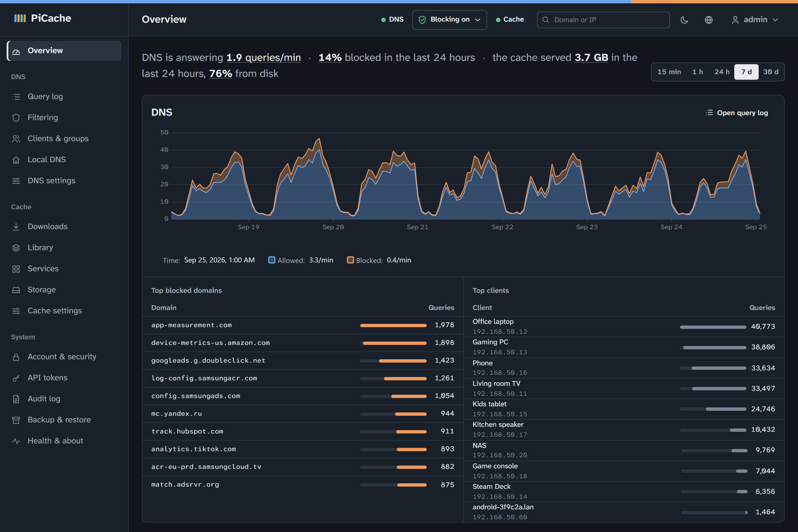
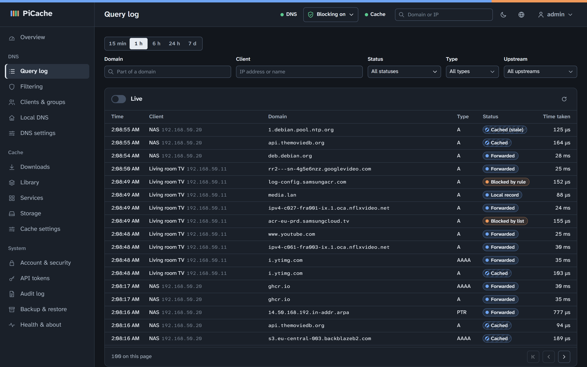
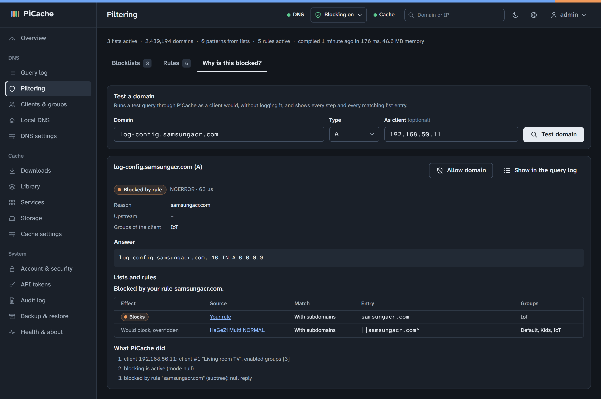
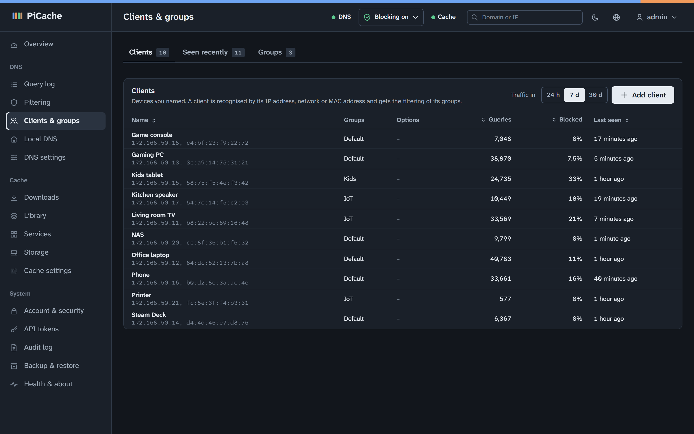
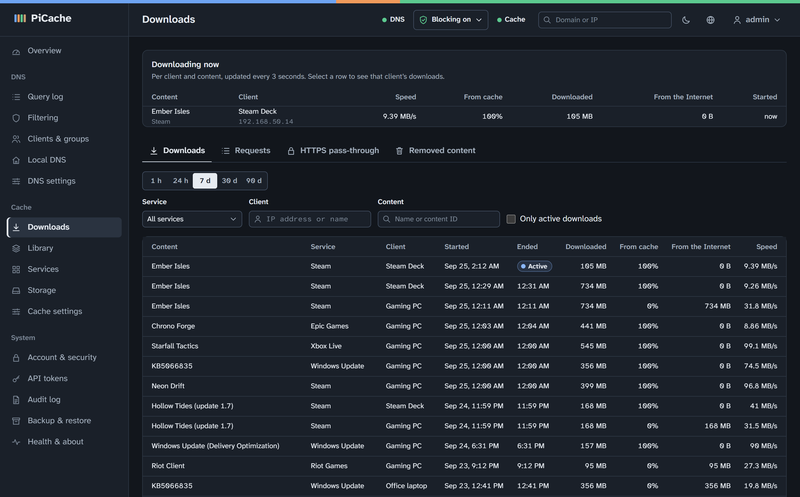
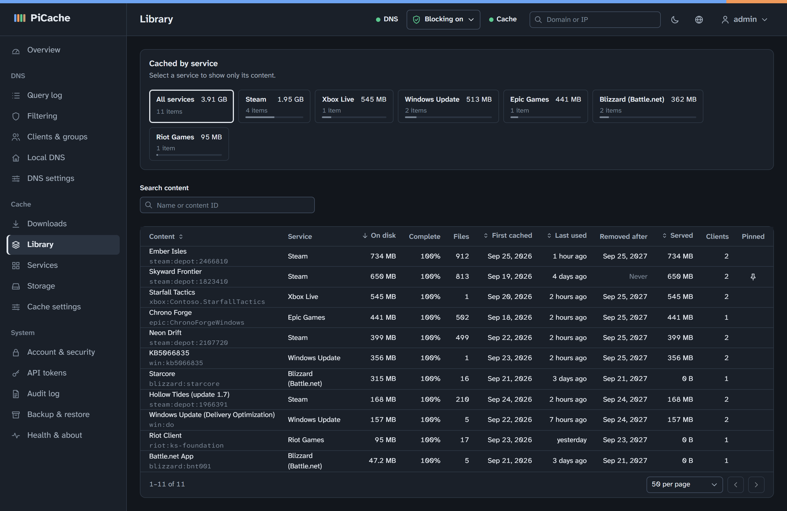
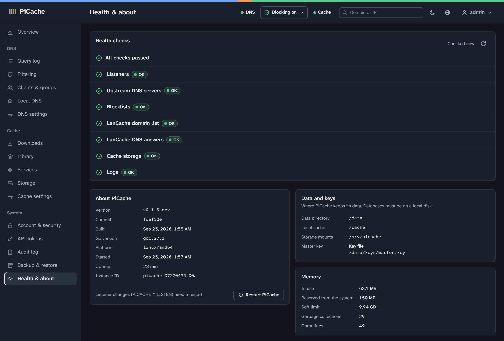
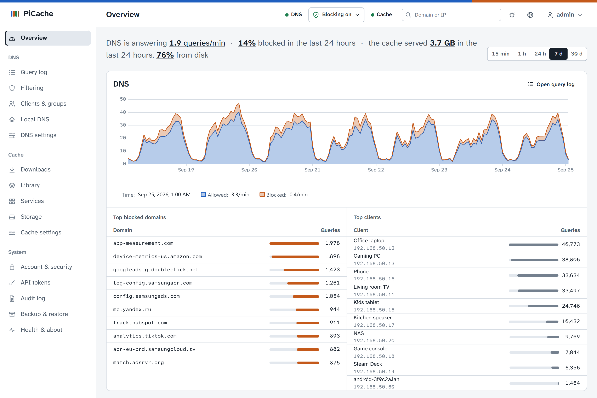
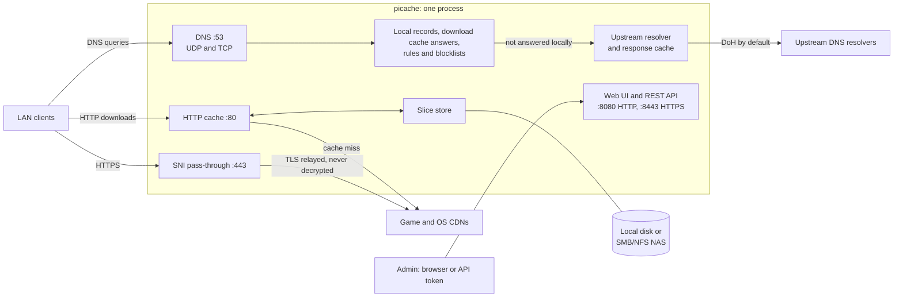

# PiCache

[](https://github.com/Hustenreizjuengling/PiCache/actions/workflows/ci.yml)
[](LICENSE)
[](go.mod)

**PiCache is the DNS server and download cache for your home lab or LAN
party, in one binary.** It filters ads and trackers for the whole network.
It also caches game and OS downloads that the CDNs deliver over plain HTTP
(Steam, Battle.net, Xbox, Windows Update and more), so they come from your
local disk or NAS after the first download. The cache uses the
cache-domains lists and works with Steam's cache discovery and with prefill
tools. One web UI shows who asked for what, what is cached and how much
bandwidth was saved. It is written in Go with an embedded Svelte UI, and no
nginx, BIND, dnsmasq or cron runs underneath: one process, one configuration
database. It is designed for a Raspberry Pi 4 or 5, a small VM or an
unprivileged Proxmox LXC container.

<picture>
  <source media="(prefers-color-scheme: light)" srcset="docs/screenshots/overview-light.png">
  
</picture>

## Features

**DNS filtering**

- Blocklists in hosts, domain, adblock (ABP) and regex formats (HaGeZi
  Multi NORMAL by default), updated automatically. The built-in catalogue
  offers 68 checked lists by category (security, privacy and vendor
  telemetry, adult content, gambling, dating, piracy, social networks,
  encrypted-DNS/VPN bypass, abused TLDs, URL shorteners, stalkerware,
  regional lists and allowlists), with their size, maintainer and license.
  A list cannot block a whole top-level domain by mistake.
- Your own allow and block rules for exact names, subdomains or regular
  expressions. Allow rules and exact or subdomain block rules take precedence
  over the lists. The UI explains which rule or list decided.
- Groups: clients (by IP, CIDR or MAC) get the lists and rules of their
  groups.
- Parental controls per group: block apps and sites such as YouTube,
  TikTok or Roblox from a built-in list of 144 services (video, social,
  messaging, games, music, AI, dating, gambling, shopping, VPN apps, app
  stores, file hosting, news), weekly schedules (a bedtime that blocks all
  internet, or selected apps during homework time), and "block internet
  now" or "lift restrictions" for a while. **Safe search** for Google,
  YouTube (moderate or strict), Bing, DuckDuckGo, Ecosia, Yandex and
  Pixabay, and **category switches** for adult content, gambling, dating,
  piracy and encrypted-DNS/VPN bypass (through downloaded lists). All of it
  stays on while blocking is paused; everything works locally, without a
  cloud service.
- Pausing: all blocking for 30 s up to 7 days or until the next morning,
  or the lists and rules of one group; parental controls, safe search and
  the protection lists stay on.
- Network check: shows whether all devices in your network use PiCache,
  detects a router that forwards every query or announces itself as IPv6
  DNS server, and gives the steps to fix it (including the FRITZ!Box
  settings). An optional scan finds devices that are switched on.
- Optional DHCP server for routers that cannot hand out another DNS server,
  switched on in the web UI when needed (nothing to install; no DHCP port is
  open while it is off): addresses, reservations (also by client identifier,
  with their own lease time; import and export), DNS names for the devices'
  host names (and generated names for the others), NTP, MTU, WPAD and extra
  search domain options, a log of recent exchanges, plus IPv6 DNS
  announcements (router advertisements with DNS server and domain only,
  never as router; stateless DHCPv6) that warn when another router announces
  its own DNS server. Off by default, and it refuses to serve while another
  DHCP server answers or PiCache's own address is dynamic.
- Blocking modes (null IP, NXDOMAIN, NODATA, REFUSED, custom IP), a timed
  pause, CNAME inspection, and blocking of the Firefox DoH canary and iCloud
  Private Relay.
- Local DNS records (A, AAAA, CNAME, TXT, wildcards, automatic PTR),
  conditional forwarding (several domains per forwarder, exceptions back to
  the default upstreams, a catch-all for bare names, bulk import), and local
  names and reverse lookups from your router. Address lookups of bare names
  such as `nas` are answered from the local domain and never sent to the
  internet.
- Encrypted upstreams (DNS-over-HTTPS and DNS-over-TLS; plain UDP/TCP too,
  also by host name) with load balancing, a fallback resolver of another
  operator for outages, a response cache and serve-stale. Quad9 (which
  blocks malware) by default; blocks of the upstream show as blocked in the
  query log.
- IPv6 on par with IPv4: clients configured by IPv4 address are recognised
  over IPv6 too (privacy addresses included), statistics per device instead
  of per address, the router over IPv6, an opt-in trust of the networks the
  machine is connected to (for a changing global IPv6 prefix), and DNS64
  or "no AAAA answers" for NAT64 and broken-IPv6 networks.
- Safe by default: not an open resolver (private networks only), rate limits
  (optionally per network), private reverse zones never leak upstream, and
  DNS rebinding protection for answers that point public names at your LAN.
  Clients can be blocked by address, network or MAC.

**Download cache**

- DNS answers that send the game and OS CDNs to the cache, from the
  cache-domains lists
  ([uklans/cache-domains](https://github.com/uklans/cache-domains)) plus
  your own services and hosts. The download cache is off until you enable
  it.
- HTTP cache on port 80 that stores 1 MiB slices, handles range requests,
  merges concurrent downloads of the same content and reads ahead.
- HTTPS pass-through on port 443: the connection is relayed by SNI and never
  decrypted, so HTTPS downloads are not cached.
- Steam finds the cache by itself (it looks up a fixed hostname to discover
  a download cache), and prefill tools work (the heartbeat path they probe
  and the response header they check).
- "What was downloaded": content grouped into games and updates (Steam
  depots, Blizzard products, Epic, Riot, Xbox packages, Windows KBs,
  PlayStation titles, …) with your own labels.
- Retention by inactivity and size, pinning, background verify and rebuild.
- Cache storage on a local disk or on an SMB/NFS NAS, with a mount guard that
  never writes into an unmounted directory.

**Web UI and operations**

- English and German UI with dashboard, live query and download streams,
  query log, statistics and health checks with hints.
- Several accounts with the roles admin and viewer (viewers see the pages
  read-only, except the audit log, notification channels and backup
  downloads, and change nothing but their own account), optional TOTP
  two-factor authentication, API tokens (`read`/`admin`) for automation, an audit
  log, backup and restore (also scheduled, for example to your NAS), and
  optional Prometheus metrics.
- Web access limited to your own networks by default, trusted reverse
  proxies (their `X-Forwarded-For` is read only when you list them), and an
  optional configuration lock for infrastructure as code.
- HTTPS for the web UI with a certificate of PiCache's own local CA, which
  your devices trust once; or upload your own certificate, or point PiCache
  at certificate files (for example from Let's Encrypt), which it reloads
  when they are renewed.
- Notifications through ntfy, Gotify or a webhook (Home Assistant) when the
  storage goes offline, a health check fails, an update is out or installed,
  or a backup fails.
- A single static binary for Linux amd64, arm64 and armv7. Deploy it with
  hardened systemd units, in a Proxmox LXC container, or as a distroless
  Docker image.
- Updates: the UI shows new releases with their notes and installs one on
  request (the program and its systemd unit files), only with a valid
  release signature and with an automatic rollback if the new version does
  not start. `sudo picache update` does the same on the command line;
  Docker images come from GHCR.

## Screenshots

All screenshots show a demo instance with made-up devices and traffic. Its
image was built with `VERSION=v0.1.0-dev`, the version on the health page.
Select an image to see it at full size.

<table>
  <tr>
    <td width="50%" valign="top">
      <a href="docs/screenshots/query-log.png"></a><br>
      <b>Query log:</b> every query with the device name, type, status (cached, stale, forwarded, local record, blocked by list or rule) and the time it took.
    </td>
    <td width="50%" valign="top">
      <a href="docs/screenshots/filtering.png"></a><br>
      <b>"Why is this blocked?":</b> a test query as the living-room TV shows which IoT rule blocks it, which list entry it overrides, and every step PiCache took.
    </td>
  </tr>
  <tr>
    <td width="50%" valign="top">
      <a href="docs/screenshots/clients.png"></a><br>
      <b>Clients &amp; groups:</b> named devices (IP and MAC), their filter group (Default, Kids, IoT), and a week of queries and block rates per device.
    </td>
    <td width="50%" valign="top">
      <a href="docs/screenshots/downloads.png"></a><br>
      <b>Downloads:</b> a Steam Deck installs a game straight from the cache while the table lists a week of game and update downloads per device, split into Internet and cache.
    </td>
  </tr>
  <tr>
    <td width="50%" valign="top">
      <a href="docs/screenshots/library.png"></a><br>
      <b>Library:</b> what is cached per game or update, with size, first cached, last used, when it will be removed, bytes served, clients and pinning.
    </td>
    <td width="50%" valign="top">
      <a href="docs/screenshots/health.png"></a><br>
      <b>Health &amp; about:</b> self-checks for listeners, upstreams, blocklists, the download cache and storage, plus version, data paths and memory.
    </td>
  </tr>
  <tr>
    <td colspan="2" align="center" valign="top">
      <a href="docs/screenshots/overview-light.png"></a><br>
      <b>Light theme:</b> the same overview in the light theme. The UI follows the system setting unless you choose light or dark yourself.
    </td>
  </tr>
</table>

## Status

PiCache is in early development. Releases are published on
[GitHub](https://github.com/Hustenreizjuengling/PiCache/releases) as static
binaries with signed checksums, and as container images at
`ghcr.io/hustenreizjuengling/picache`. The version a build reports depends
on how it was built:

- Releases (binaries and images): the tag, for example `v0.1.0`.
- `make` and `make docker`: the output of
  `git describe --tags --always --dirty`, for example `v0.1.0-3-gabc1234`
  (with `-dirty` if the tree has uncommitted changes). `make VERSION=v0.1.0`
  sets it explicitly.
- CI builds: the commit hash.
- A plain `go build`, and the image that `docker compose up --build` builds
  (the compose files pass no build arguments): `dev`. Such builds skip the
  automatic database copy before an upgrade, see
  [Updates](docs/DEPLOYMENT.md#updates).

Not included: DNS-over-HTTPS/TLS for clients and local DNSSEC
validation. TLS interception of downloads is never done. Docker Desktop on macOS and Windows
is not a deployment target.

## Quick start

**Debian 12/13 (bare metal, VM, Raspberry Pi, LXC), one line:**

```sh
curl -fsSL https://github.com/Hustenreizjuengling/PiCache/releases/latest/download/get-picache.sh | sudo sh
# open http://<ip>:8080/ and create the admin account with the setup token it shows
```

The script verifies the release signature before it installs anything
([details and options](docs/DEPLOYMENT.md#one-line-install); to read it
first, download it and run `sudo sh get-picache.sh`).

**Debian 12/13 by hand:** download the binary for
your machine (`picache-linux-amd64`, `-arm64` or `-armv7`),
`picache-deploy.tar.gz`, `SHA256SUMS` and `SHA256SUMS.sig` from the
[latest release](https://github.com/Hustenreizjuengling/PiCache/releases/latest)
and check them ([how](docs/DEPLOYMENT.md#download)). Then:

```sh
tar -xzf picache-deploy.tar.gz          # deploy/, LICENSE, THIRD_PARTY_NOTICES.md
sudo sh deploy/install.sh --binary ./picache-linux-amd64
sudo picache setup-token
# open http://<ip>:8080/ and create the admin account
```

**Proxmox VE (unprivileged LXC):** create a Debian 12/13 container with
`nesting=1` and a static IP, copy the binary and `picache-deploy.tar.gz`
into it and run the same installer. See
[deploy/lxc/README.md](deploy/lxc/README.md), which also covers NAS mounts.

**Docker (host networking)**

```sh
git clone https://github.com/hustenreizjuengling/picache.git   # or unpack picache-deploy.tar.gz
cd picache/deploy/docker
docker compose up -d        # pulls ghcr.io/hustenreizjuengling/picache:latest
docker exec -u 65532:65532 picache /picache setup-token
# open http://<host-ip>:8080/
```

Then point your router's DHCP DNS option at PiCache. If port 53 is already
in use (for example by systemd-resolved), see
[Port 53 conflicts](docs/DEPLOYMENT.md#port-53-conflicts).

**Updates:** **System → Updates** in the web UI shows new releases and, on
bare metal, VMs and LXC, installs them; on the command line use
`sudo picache update`, with Docker `docker compose pull && docker compose up -d`.
See [Updates](docs/DEPLOYMENT.md#updates).

**From source** (Go 1.27, Node.js 22, GNU make):

```sh
git clone https://github.com/hustenreizjuengling/picache.git
cd picache
make              # web UI + bin/picache for this machine
make build-all    # static bin/picache-linux-{amd64,arm64,armv7}
```

Install such a binary with `sudo sh deploy/install.sh --binary
bin/picache-linux-amd64`, or build the Docker image with
`docker compose up -d --build` in `deploy/docker`.

## Architecture



For names of enabled cache services, the DNS server answers with
PiCache's own address, so the clients' downloads arrive at the HTTP cache on
port 80 and the SNI pass-through on port 443. Both resolve the real CDN
addresses through the upstream resolver, which bypasses the overrides,
filtering and local records. The web UI and API reach every component. The
full specification is in [docs/ARCHITECTURE.md](docs/ARCHITECTURE.md).

## Stack

**Backend**

- Go 1.27 (`go 1.27.0` in `go.mod`); the code uses `encoding/json/v2`,
  which is part of the standard library from Go 1.27.
- No CGO (`CGO_ENABLED=0`). Release builds are static binaries for
  linux/amd64, linux/arm64 and linux/arm (GOARM=7), built with `-trimpath`
  and the version set through `-ldflags`. The code also builds and its tests
  run on Windows and macOS for development (`*_other.go` fallbacks next to
  the `*_linux.go` files).
- Third-party Go modules, deliberately few:

  | Module | Version | Used for |
  |---|---|---|
  | `github.com/miekg/dns` | v1.1.73 | DNS messages, the UDP and TCP listeners, upstream exchanges |
  | `modernc.org/sqlite` | v1.59.0 | SQLite without CGO: SQLite translated to Go, with `modernc.org/libc` v1.75.7 pinned exactly |
  | `golang.org/x/crypto` | v0.57.0 | argon2id password hashes; XChaCha20-Poly1305 for stored secrets (NAS passwords, TOTP secrets) |
  | `golang.org/x/net` | v0.59.0 | public suffix list (validation of cache-domains patterns), HTTP header validation |
  | `golang.org/x/sys` | v0.48.0 | Linux system calls: statfs for free space, the mount guard and the local-disk check of the databases; opening key files without following links |
  | `golang.org/x/time` | v0.16.0 | token-bucket limiter for the global sign-in attempt limit |
  | `golang.org/x/sync` | v0.23.0 | pinned in `go.mod` through `internal/deps`, but not used by the current code |

- Standard library: `net/http` with method and wildcard route patterns for
  the REST API, `http.CrossOriginProtection` against CSRF,
  `http.ResponseController` for per-request deadlines and Server-Sent Events
  for the live streams, `http.FileServerFS` over `embed.FS` for the UI, and
  HTTP/2 for DNS-over-HTTPS; `crypto/tls` and `crypto/x509` for the web
  certificate (a local CA with name constraints, ECDSA P-256, unless you
  provide a certificate); `os.Root` for file access in the cache
  store and the downloaded snapshots; `log/slog`; `net/netip`;
  `testing/synctest` in tests. Cache hits are sent with `sendfile(2)` where
  possible, and the SNI relay copies with `splice(2)`, both through the
  zero-copy paths of Go's `net` package.

**Frontend** (`web/`)

- Svelte 5.57.1 (runes) and TypeScript 6.0.3, built with Vite 8.3.0
  (`@sveltejs/vite-plugin-svelte` 7.3.1) and type-checked with svelte-check
  4.7.6. A single-page app with a hash router and lazily loaded pages.
- uPlot 1.6.32 for charts is the only runtime dependency besides Svelte.
- Fonts: Atkinson Hyperlegible Next and Mono, self-hosted from
  `@fontsource-variable` 5.3.0 (WOFF2, latin and latin-ext).
- No CDN and no external requests. The server sends a strict
  Content-Security-Policy (`default-src 'none'`, `script-src 'self'`,
  `connect-src 'self'`, `font-src 'self'`, `frame-ancestors 'none'`; inline
  styles are allowed, inline scripts are not). The theme is applied by an
  external `theme-init.js` for that reason.
- `vite build` writes to `internal/webui/dist`, which the binary embeds with
  `go:embed`. Hashed assets are cached for a year; `index.html` is
  revalidated on every load.
- English and German: `web/src/i18n/{en,de}/*.ts`; the German dictionaries
  are type-checked against the English keys.

**Data**

- Three kinds of SQLite database, all on local disk in the data directory
  (PiCache refuses to open them on NFS or CIFS): `picache.db` holds the
  configuration (settings, lists, rules, clients, groups, local records,
  services, storage targets), the accounts, sessions, API tokens and the
  audit log; `logs.db` holds the query log, cache and SNI events, download
  sessions, statistics rollups and evictions;
  `cache-index/<store-id>.db` indexes one cache store.
- WAL mode with a single writer connection and a read-only reader pool,
  `trusted_schema` off, per-component migrations with table names prefixed
  by component.
- Slice store (local directory or NAS mount), one per storage target:

  ```
  <root>/.picache-store                           store marker (JSON: store ID, format, slice size)
  <root>/tmp/                                     temporary files, renamed into place
  <root>/slices/<h0h1>/<h2h3>/<objectId>.<index>  one slice of 1 MiB (default)
  ```

  Each slice file starts with a header (object ID, index, service, host,
  path, total size, CRC32C of the data, stored response headers), so a lost
  index can be rebuilt from the files. Only slice files may live on a NAS.

**Deployment**

- Debian 12/13 with systemd (bare metal, VM, Raspberry Pi):
  `deploy/install.sh` installs `picache.service`, which runs as the system
  user `picache` with only `CAP_NET_BIND_SERVICE` (and `CAP_NET_RAW`, used
  only at start for the optional IPv6 router advertisements and dropped
  right after; PiCache refuses to run if that fails), `NoNewPrivileges=yes`,
  `ProtectSystem=strict`, `ProtectHome`, `PrivateTmp`, `PrivateDevices`,
  `RestrictAddressFamilies`, `MemoryDenyWriteExecute` and
  `SystemCallFilter=@system-service ~@privileged`, among others. An optional
  root helper (`picache-storage.path` and `.service`) mounts NAS shares on
  request of the web UI, and the update helper (`picache-update.path` and
  `.service`, installed unless `--without-updater`) installs signed releases
  and their unit files on request of the web UI.
- Docker: a multi-stage build (Node 22 and Go 1.27 Alpine stages) into
  `gcr.io/distroless/static-debian13` (no shell). The container starts as
  root only to bind ports 53, 80 and 443 (and, while the DHCP server is
  switched on, the DHCP ports and the raw socket for IPv6 router
  advertisements), then drops to `65532:65532` before it opens its data and
  checks that it cannot regain root. The compose file uses host networking,
  `cap_drop: [ALL]` plus `NET_BIND_SERVICE`, `SETUID`, `SETGID` and
  `NET_RAW` (used only at start for that raw socket; the switch to 65532
  clears it with every other capability), `no-new-privileges` and a
  read-only root filesystem; the image's health check runs `picache healthcheck`, whose
  DNS probe is answered locally and never counted or logged.
- Proxmox VE: an unprivileged Debian container with `nesting=1` and the same
  installer. NAS shares are mounted on the Proxmox host and bind-mounted into
  the container, because an unprivileged container cannot mount SMB or NFS.

**CI** (GitHub Actions, [`.github/workflows/ci.yml`](.github/workflows/ci.yml),
on pushes to `main` and on pull requests)

- Web UI: `npm ci`, `svelte-check` and `vite build` on Node 22.
- Go on Ubuntu, Windows and macOS: `go vet` and `go test ./...`; on Linux
  also `gofmt` and `go vet` for linux/arm (v7).
- `govulncheck` (v1.8.0) against the dependencies.
- Static binaries for the three Linux targets with the embedded UI, kept as
  workflow artifacts for 7 days.
- Deployment files: `sh -n` and ShellCheck for the shell scripts,
  `docker compose config` for both compose files, and an installer smoke test
  in a Debian container.
- A multi-arch Docker build (linux/amd64, linux/arm64, linux/arm/v7) that is
  not pushed anywhere, and a check of `make dist` (the release files).

**Releases** ([`.github/workflows/release.yml`](.github/workflows/release.yml),
on pushed `v*` tags): `make dist` builds the three static binaries,
`picache-deploy.tar.gz` and `SHA256SUMS`; the workflow signs `SHA256SUMS`
with the Ed25519 release key, publishes a GitHub release with the
`CHANGELOG.md` section as notes (a pre-release for tags with a hyphen), and
pushes multi-arch images to `ghcr.io/hustenreizjuengling/picache` (`X.Y.Z`,
and for stable releases `X.Y` and `latest`). See
[CONTRIBUTING.md](CONTRIBUTING.md#releases).

## Persistent data

| Data | Bare metal / LXC | Docker | Back up? |
|---|---|---|---|
| Configuration, account and audit log (`picache.db`), history and statistics (`logs.db`), cache indexes, master key, TLS certificate, list snapshots | `/var/lib/picache` | volume `picache-data` at `/data` | `picache.db`; keep `keys/master.key` separately |
| Built-in local cache store (slice files) | `/var/cache/picache` | volume `picache-cache` at `/cache` | No, it fills again |
| NAS cache stores | `/srv/picache/<id>` | optional bind mount of `/srv/picache` (`rslave`) | No |
| Bootstrap settings (listeners, paths, logging) | `/etc/picache/picache.env` | `environment:` in the compose file | Yes |

Details, including backup and restore, are in
[docs/DEPLOYMENT.md](docs/DEPLOYMENT.md#persistent-data).

## Security

- Not an open resolver: PiCache answers loopback, private and directly
  connected private networks (plus networks you add), with a per-client rate
  limit.
- Unprivileged: the systemd service holds only `CAP_NET_BIND_SERVICE`, the
  container drops to UID 65532 after binding its ports, and the service
  never holds `CAP_SYS_ADMIN`.
- The first account is created with a one-time setup token. Passwords are
  hashed with argon2id, sign-ins are throttled, and TOTP is optional.
  Viewer accounts and read tokens cannot change anything; accounts and
  certificates are managed only in an admin's browser session.
- New installations allow the web UI only from this machine, the private
  and connected networks and the networks you add; a proxy's
  `X-Forwarded-For` is read only from addresses you trust.
- Strict Content-Security-Policy, `HttpOnly` and `SameSite=Strict` session
  cookies, cross-origin protection and a host allowlist against DNS
  rebinding; the resolver blocks rebinding answers for the whole network.
- The HTTP cache serves only hosts of known cache services and, by
  default, connects only to public upstream addresses (SSRF protection).
  HTTPS is relayed without being decrypted.
- NAS passwords and TOTP secrets are sealed with XChaCha20-Poly1305. Backups
  never contain accounts, sessions or API tokens.
- Updates are installed only with a valid Ed25519 signature from the release
  key built into PiCache ([docs/release-key.pem](docs/release-key.pem)). The
  web UI can only ask the root helper for a newer version number, and the
  daily update check, which contacts only `api.github.com`, can be turned
  off.

Threat model, hardening checklist and how to report a vulnerability:
[docs/SECURITY.md](docs/SECURITY.md). Please report vulnerabilities
privately, not in a public issue.

## Documentation

- [docs/DEPLOYMENT.md](docs/DEPLOYMENT.md): downloads, installation,
  first-run setup, backup and restore, updates, storage, environment
  variables, CLI.
- [deploy/lxc/README.md](deploy/lxc/README.md): Proxmox LXC and NAS.
- [docs/SECURITY.md](docs/SECURITY.md): threat model, updates and the
  release key, hardening checklist, reporting vulnerabilities.
- [docs/ARCHITECTURE.md](docs/ARCHITECTURE.md): design and specification.
- [docs/API.md](docs/API.md): REST API.
- [docs/DESIGN.md](docs/DESIGN.md) and [web/README.md](web/README.md): UI
  design system and frontend guide.
- [CONTRIBUTING.md](CONTRIBUTING.md) and [CHANGELOG.md](CHANGELOG.md).

## Development

```sh
make web     # build the UI into internal/webui/dist (or: cd web && npm run dev)
make build   # bin/picache
make test vet lint
bin/picache serve --dev --data-dir ./data --cache-dir ./cache \
  --dns-listen 127.0.0.1:1053 --cache-listen off --sni-listen off \
  --web-listen 127.0.0.1:8080 --web-tls-listen off
```

The UI development server (`npm run dev` in `web/`) proxies `/api` to
`127.0.0.1:8080`. `scripts/test-install.sh bin/picache-linux-amd64` runs the
installer smoke test in a throwaway Debian container (needs Docker). See
[CONTRIBUTING.md](CONTRIBUTING.md) before you open a pull request; the
project follows its [code of conduct](CODE_OF_CONDUCT.md).

## Kurzüberblick (Deutsch)

PiCache ist ein filternder DNS-Server und ein Download-Cache in einem
einzigen Programm mit Weboberfläche (Deutsch und Englisch).

- **DNS-Filter** für das ganze Netz: Blocklisten, eigene Regeln,
  Gruppen pro Client, lokale DNS-Einträge, verschlüsselte Upstreams
  (DoH/DoT) mit Ausweich-DNS, Schutz vor DNS-Rebinding, Abfrageprotokoll
  und Statistiken.
- **Jugendschutz** pro Gruppe: Dienste wie YouTube, TikTok oder Roblox
  sperren (144 Dienste), Zeitpläne (Schlafenszeit, Hausaufgabenzeit),
  „Internet jetzt sperren“ oder „Einschränkungen aufheben“ auf Zeit,
  SafeSearch für Google, YouTube, Bing, DuckDuckGo, Ecosia, Yandex und
  Pixabay sowie Kategorien (Erwachseneninhalte, Glücksspiel, Dating,
  Raubkopien, Umgehung per VPN oder verschlüsseltem DNS) über
  heruntergeladene Listen – alles lokal, ohne Cloud-Dienst. Der **Netzwerk-Check**
  zeigt, ob alle Geräte PiCache nutzen, und erklärt die Einstellungen im
  Router (auch für die FRITZ!Box).
- **Download-Cache** für Spiele und Updates (Steam, Epic, Battle.net, Riot,
  Xbox, Windows Update, PlayStation, Nintendo, …): Downloads, die über
  unverschlüsseltes HTTP laufen, werden nach dem ersten Mal aus dem lokalen
  Netz geliefert, wahlweise von einer lokalen SSD oder einem NAS (SMB/NFS).
  HTTPS wird nur durchgereicht, nie entschlüsselt und nicht gecacht. Die
  Oberfläche zeigt, was heruntergeladen wurde und wie viel Bandbreite
  gespart wurde. Der Cache nutzt die cache-domains-Listen und funktioniert
  mit der Cache-Erkennung von Steam und mit Prefill-Tools.
- **Sicher voreingestellt:** kein offener Resolver, unprivilegierter Dienst,
  Einrichtung per Einmal-Token, Weboberfläche nur aus den eigenen Netzen,
  mehrere Konten (Admins und Betrachter, die nur lesen), optionale
  Zwei-Faktor-Anmeldung, API-Tokens, HTTPS mit einer eigenen lokalen
  Zertifizierungsstelle.
- **DHCP-Server** (optional), falls der Router keinen anderen DNS-Server
  verteilen kann: wird bei Bedarf in der Oberfläche eingeschaltet (keine
  Installationsoption; solange er aus ist, belegt PiCache keinen DHCP-Port),
  mit Reservierungen, DNS-Namen der Geräte und IPv6-DNS-Ankündigungen.
- **Betrieb** auf Debian 12/13 (auch Raspberry Pi 4/5), in einem Proxmox-LXC
  oder mit Docker.
- **Updates:** Die Oberfläche zeigt neue Versionen an und installiert sie auf
  Wunsch, nur mit gültiger Signatur und mit automatischer Rückkehr zur alten
  Version, falls die neue nicht startet (`sudo picache update` auf der
  Kommandozeile, bei Docker `docker compose pull && docker compose up -d`).
- **Stand:** frühe Entwicklung. Releases gibt es auf
  [GitHub](https://github.com/Hustenreizjuengling/PiCache/releases)
  (Binärdateien mit signierten Prüfsummen) und als Container-Image
  `ghcr.io/hustenreizjuengling/picache`.

Schnellstart auf Debian: Binärdatei und `picache-deploy.tar.gz` des neuesten
Releases herunterladen und prüfen, `tar -xzf picache-deploy.tar.gz`, dann
`sudo sh deploy/install.sh --binary <datei>` und `sudo picache setup-token`
ausführen und `http://<ip>:8080/` öffnen.
Anschließend im Router (DHCP) die IP von PiCache als DNS-Server eintragen.
Auf einem Raspberry Pi gehört der Cache auf eine USB-SSD, nicht auf die
SD-Karte. Details stehen in [docs/DEPLOYMENT.md](docs/DEPLOYMENT.md)
(englisch). Sicherheitslücken bitte vertraulich melden, siehe
[docs/SECURITY.md](docs/SECURITY.md).

PiCache steht unter der MIT-Lizenz ([LICENSE](LICENSE)).

## License

PiCache is released under the [MIT license](LICENSE). The binary and the
container image also contain third-party components under their own
licenses (BSD-3-Clause, MIT, SIL Open Font License 1.1 for the fonts, and
public domain for SQLite); see
[THIRD_PARTY_NOTICES.md](THIRD_PARTY_NOTICES.md). Keep both files with every
copy you pass on. `deploy/install.sh` installs them to
`/usr/share/doc/picache/`, and the container image contains them in the same
directory.
