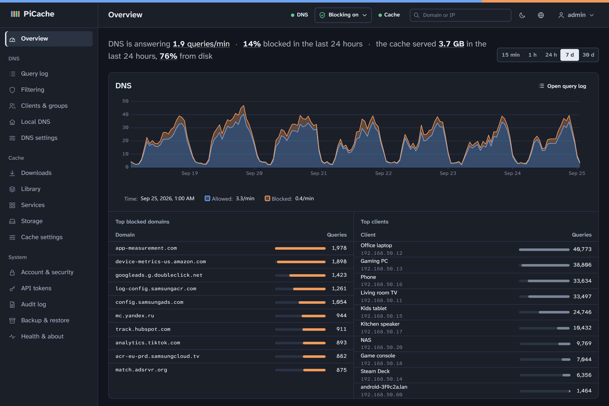
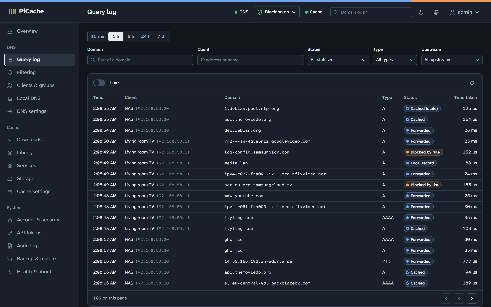
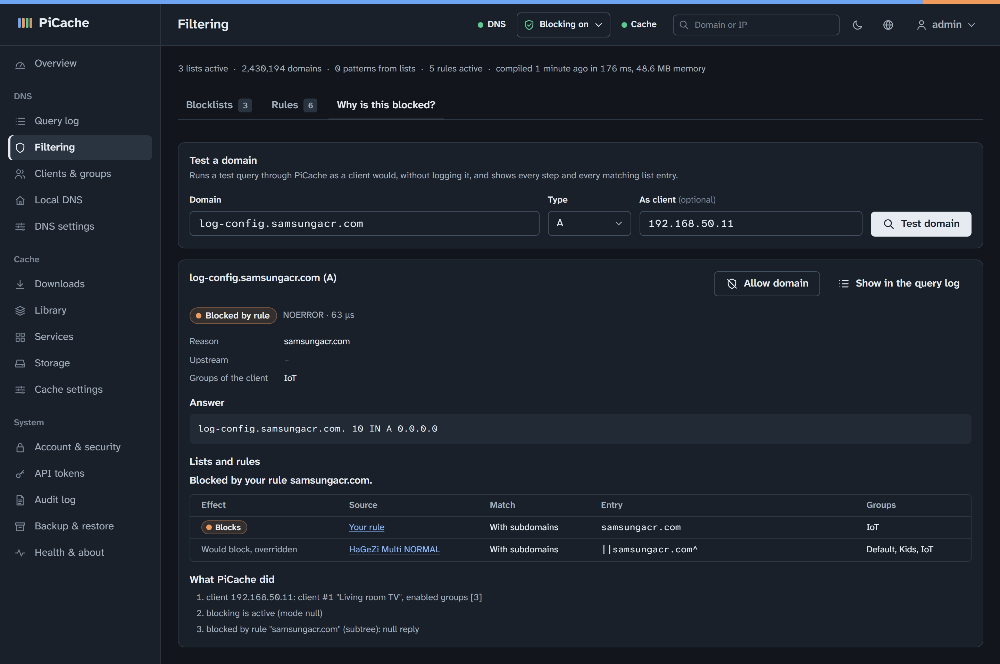
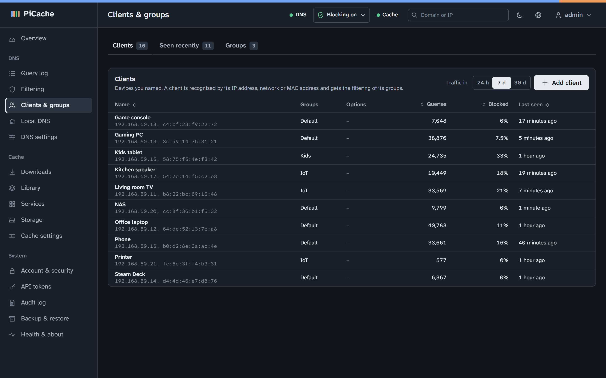
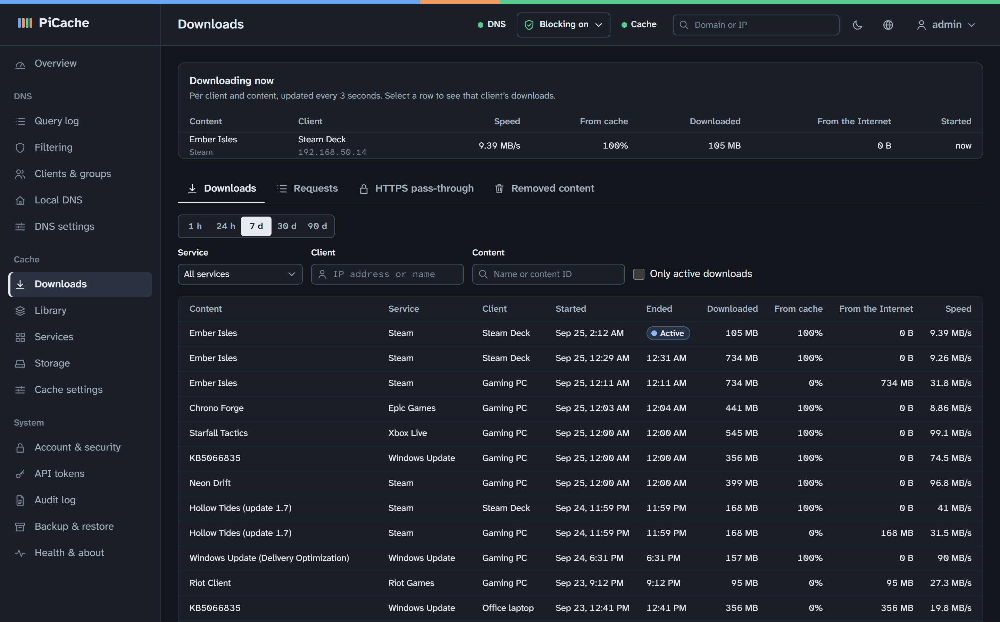
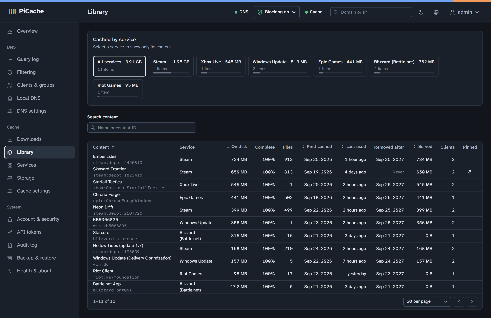
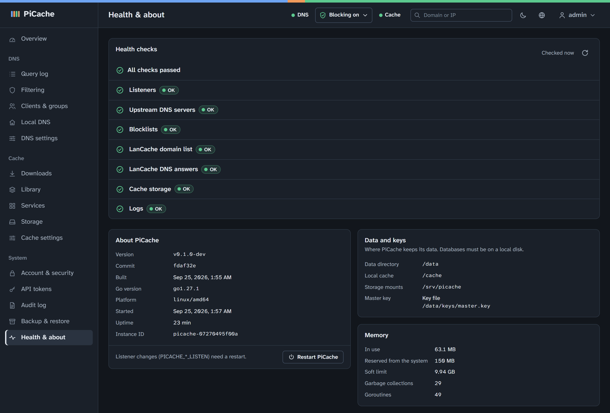
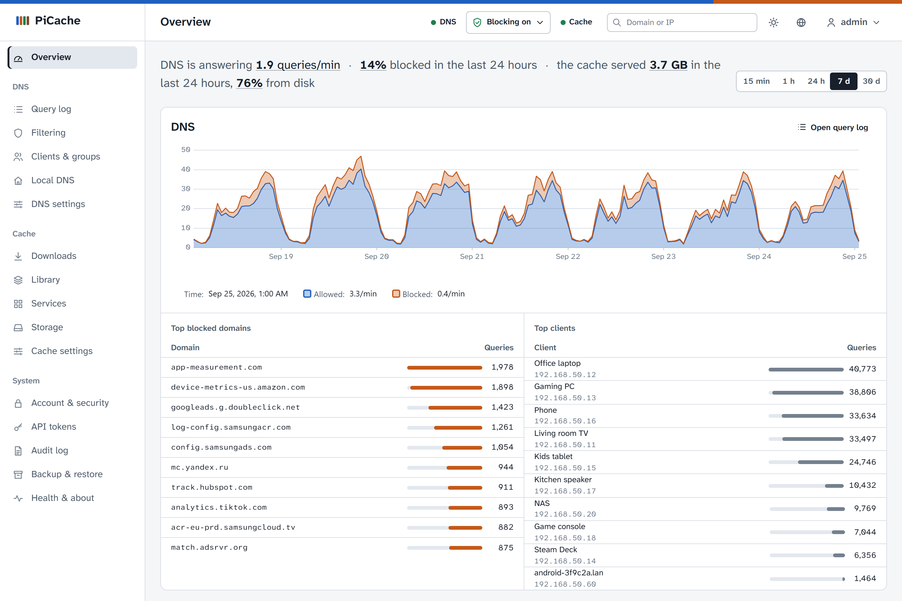

# PiCache

[](https://github.com/Hustenreizjuengling/PiCache/actions/workflows/ci.yml)
[](LICENSE)
[](go.mod)

**PiCache is the DNS server and download cache for your home lab or LAN
party, in one binary.** It filters ads and trackers for the whole network.
It also caches game and OS downloads that the CDNs deliver over plain HTTP
(Steam, Battle.net, Xbox, Windows Update and more), so they come from your
local disk or NAS after the first download. The cache uses the
cache-domains lists and works with Steam's cache discovery and with prefill
tools. One web UI shows who asked for what, what is cached and how much
bandwidth was saved. It is written in Go with an embedded Svelte UI, and no
nginx, BIND, dnsmasq or cron runs underneath: one process, one configuration
database. It is designed for a Raspberry Pi 4 or 5, a small VM or an
unprivileged Proxmox LXC container.

<picture>
  <source media="(prefers-color-scheme: light)" srcset="docs/screenshots/overview-light.png">
  
</picture>

## Features

**DNS filtering**

- Blocklists in hosts, domain, adblock (ABP) and regex formats (HaGeZi
  Multi NORMAL by default), updated automatically. The built-in catalogue
  offers 68 checked lists by category (security, privacy and vendor
  telemetry, adult content, gambling, dating, piracy, social networks,
  encrypted-DNS/VPN bypass, abused TLDs, URL shorteners, stalkerware,
  regional lists and allowlists), with their size, maintainer and license.
  A list cannot block a whole top-level domain by mistake. List lines with
  query types (`$dnstype`) and exceptions (`$denyallow`) are understood, and
  a list's title becomes its name.
- Your own allow and block rules for exact names, subdomains or regular
  expressions, per query type (for example only AAAA), with their own reply
  (NXDOMAIN, an address, this server's address, …), exceptions for
  subdomains and inverted regular expressions. Allow rules and exact or
  subdomain block rules take precedence over the lists. The UI explains
  which rule or list decided, searches your rules and the downloaded lists,
  imports and exports rules as text and changes many rules at once.
- Blocking by answer address: lists of malicious server addresses and your
  own IP rules block answers that point at them; broad and private
  networks can never be blocked by a list.
- Groups: clients (by IP, CIDR, MAC or ClientID) get the lists and rules of
  their groups; "Only for this device" in the query log makes a rule for one
  device. A group can use its own upstream resolver, such as a family-safe
  DNS service (Cloudflare for Families, OpenDNS FamilyShield, CleanBrowsing).
- Parental controls per group: block apps and sites such as YouTube,
  TikTok or Roblox from a built-in list of 144 services (video, social,
  messaging, games, music, AI, dating, gambling, shopping, VPN apps, app
  stores, file hosting, news), weekly schedules (a bedtime that blocks all
  internet, or selected apps during homework time), and "block internet
  now" or "lift restrictions" for a while. **Safe search** for Google,
  YouTube (moderate or strict), Bing, DuckDuckGo, Ecosia, Yandex and
  Pixabay, and **category switches** for adult content, gambling, dating,
  piracy and encrypted-DNS/VPN bypass (through downloaded lists). All of it
  stays on while blocking is paused; everything works locally, without a
  cloud service.
- Pausing: all blocking for 30 s up to 7 days or until the next morning,
  or the lists and rules of one group; parental controls, safe search and
  the protection lists stay on.
- Network check: shows whether all devices in your network use PiCache,
  detects a router that forwards every query or announces itself as IPv6
  DNS server, and gives the steps to fix it (including the FRITZ!Box
  settings). An optional scan finds devices that are switched on.
- Optional DHCP server for routers that cannot hand out another DNS server,
  switched on in the web UI when needed (nothing to install; no DHCP port is
  open while it is off): addresses, reservations (also by client identifier,
  with their own lease time; import and export), DNS names for the devices'
  host names (and generated names for the others), NTP, MTU, WPAD and extra
  search domain options, a log of recent exchanges, plus IPv6 DNS
  announcements (router advertisements with DNS server and domain only,
  never as router; stateless DHCPv6) that warn when another router announces
  its own DNS server. Off by default, and it refuses to serve while another
  DHCP server answers or PiCache's own address is dynamic.
- Blocking modes (null IP, NXDOMAIN, NODATA, REFUSED, custom IP), a timed
  pause, CNAME inspection, and blocking of the Firefox DoH canary and iCloud
  Private Relay.
- Local DNS records (A, AAAA, CNAME, TXT, SRV, MX, PTR, HTTPS, SVCB,
  wildcards, automatic PTR), per group (split horizon: another answer for
  guests than for staff), with the local address first for multi-address
  names, imported from a hosts file; conditional forwarding (several domains per forwarder, exceptions back to
  the default upstreams, a catch-all for bare names, bulk import), and local
  names and reverse lookups from your router. Address lookups of bare names
  such as `nas` are answered from the local domain and never sent to the
  internet.
- Encrypted upstreams (DNS-over-HTTPS, DNS-over-TLS, DNS-over-QUIC, DNS
  over HTTP/3 and DNSCrypt, also as DNS stamps `sdns://` with certificate
  pins; plain UDP/TCP too, also by host name) with load balancing, a
  fallback resolver of another operator for outages, a response cache and
  serve-stale. Quad9 (which blocks malware) by default; blocks of the
  upstream show as blocked in the query log.
- Local DNSSEC validation (on by default in new installations): PiCache
  checks the signatures of signed domains itself, from the root zone's
  built-in keys, answers forged ones with SERVFAIL and sets the AD flag
  only for answers it verified. The query log shows each answer's DNSSEC
  status (secure, insecure, bogus, indeterminate), the health check warns
  about upstreams without DNSSEC data or a wrong clock, and a test button
  shows whether it works with your upstreams. Pass-through of the
  upstream's verdict (for a validating resolver such as Unbound) and off
  are the other modes.
- Encrypted DNS for your devices: DNS-over-TLS on port 853
  (`PICACHE_DOT_LISTEN`) and DNS-over-HTTPS at `/dns-query` on the web
  ports or on a port of its own (`PICACHE_DOH_LISTEN`), switched on in the
  web UI with a server name (Android Private DNS, iPhone/iPad/Mac, Windows
  11, browsers). ClientIDs in the server name or the DoH path tell devices
  apart that share an address (they identify a device, they do not
  authenticate it); Discovery of Designated Resolvers (DDR) lets devices
  upgrade to encrypted DNS by themselves; configuration profiles for
  Apple devices, also as a QR code link. Plain DNS can be switched off for
  everyone but this machine (it stays on while no encrypted protocol is
  serving).
- IPv6 on par with IPv4: clients configured by IPv4 address are recognised
  over IPv6 too (privacy addresses included), statistics per device instead
  of per address, the router over IPv6, an opt-in trust of the networks the
  machine is connected to (for a changing global IPv6 prefix), and DNS64
  or "no AAAA answers" for NAT64 and broken-IPv6 networks.
- Safe by default: not an open resolver (private networks only), rate limits
  (optionally per network), private reverse zones never leak upstream, and
  DNS rebinding protection for answers that point public names at your LAN.
  Clients can be blocked by address, network, MAC or ClientID.

**Download cache**

- DNS answers that send the game and OS CDNs to the cache, from the
  cache-domains lists
  ([uklans/cache-domains](https://github.com/uklans/cache-domains)) plus
  your own services and hosts. The download cache is off until you enable
  it.
- HTTP cache on port 80 that stores 1 MiB slices, handles range requests,
  merges concurrent downloads of the same content and reads ahead.
- HTTPS pass-through on port 443: the connection is relayed by SNI and never
  decrypted, so HTTPS downloads are not cached.
- Steam finds the cache by itself (it looks up a fixed hostname to discover
  a download cache), and prefill tools work (the heartbeat path they probe
  and the response header they check).
- "What was downloaded": content grouped into games and updates (Steam
  depots, Blizzard products, Epic, Riot, Xbox packages, Windows KBs,
  PlayStation titles, …) with your own labels.
- Retention by inactivity and size, pinning, background verify and rebuild.
- Cache storage on a local disk or on an SMB/NFS NAS, with a mount guard that
  never writes into an unmounted directory.

**Web UI and operations**

- A web UI in English and German with a getting-started checklist for new installations, step-by-step
  guides for single devices, a search over all settings, dashboard, live
  query and download streams,
  query log, statistics and health checks with hints. Statistics over up to
  a year (daily summaries), top domains and upstreams with their response
  times, query types, an estimate of the distinct domains, activity charts
  per client and device, and an export of the query log as NDJSON or CSV
  (also `picache logs export`; `picache logs tail` follows it in a
  terminal).
- Privacy levels (full, hide domains, anonymous, off) with the switches
  behind them: anonymised client addresses, hidden domain names, no query
  log or no statistics; clients excluded from the log or the statistics,
  ignored domains, and clearing the query log or the statistics. All data
  stays on the machine.
- Diagnostics: the application log in the web UI with a temporary debug
  level, host resources (memory, load, temperatures, disks) with health
  thresholds, database sizes, a history of past warnings to acknowledge,
  a redacted support bundle for bug reports, and `picache db check` /
  `picache db salvage` to recover a damaged configuration database.
- Several accounts with the roles admin and viewer (viewers see the pages
  read-only, except the audit log, the application log, notification
  channels and backup downloads, and change nothing but their own account), optional TOTP
  two-factor authentication, API tokens (`read`/`admin`/`sync`) for automation, an audit
  log, backup and restore (also scheduled, for example to your NAS, and of
  selected sections only), and optional Prometheus metrics.
- A command line for daily tasks and automation: `picache status [--watch]`,
  `pause`, `resume`, `explain`, `query`, `allow`, `deny`, `lists update`,
  `config get|set|apply` (settings as JSON, with a dry run) and
  `PICACHE_INITIAL_CONFIG` for a pre-configured first start.
- A second PiCache can follow a primary (clients and groups, lists and
  rules, local DNS, parental controls, DNS settings), pulled over HTTPS with
  a sync token that can read nothing else.
- Devices with the vendor of their MAC address (or "private address"),
  their interface and optionally the owner of a public network; clients
  identified by interface (guest VLANs, VPNs) or host name; names from DHCP,
  PTR and the hosts file, each switchable; seen devices can be forgotten.
- Listeners, an outbound proxy (for list downloads, the release check and
  notifications) and an optional NTP server set in the web UI; the log also
  to a file or a syslog server; update channels stable, beta and nightly.
- Web access limited to your own networks by default, trusted reverse
  proxies (their `X-Forwarded-For` is read only when you list them), and an
  optional configuration lock for infrastructure as code.
- HTTPS for the web UI with a certificate of PiCache's own local CA, which
  your devices trust once; or upload your own certificate, or point PiCache
  at certificate files (for example from Let's Encrypt), which it reloads
  when they are renewed.
- Notifications through ntfy, Gotify or a webhook (Home Assistant) when the
  storage goes offline, a health check fails, an update is out or installed,
  or a backup fails.
- A single static binary for Linux amd64, arm64 and armv7 (best effort:
  armv6, 386 and riscv64). Deploy it with hardened systemd units on Debian,
  Ubuntu, Fedora, RHEL/Alma/Rocky, Arch or openSUSE, as a Debian package
  (updated with apt), in a Proxmox LXC container, or as a distroless Docker
  image (also with its own LAN address, and with templates for Unraid,
  TrueNAS SCALE and Synology). The REST API is described in OpenAPI 3.1
  (`GET /api/v1/openapi.json`).
- Updates: the UI shows new releases with their notes and installs one on
  request (the program and its systemd unit files), only with a valid
  release signature and with an automatic rollback if the new version does
  not start. `sudo picache update` does the same on the command line;
  Docker images come from GHCR.

## Screenshots

All screenshots show a demo instance with made-up devices and traffic. Its
image was built with `VERSION=v0.1.0-dev`, the version on the health page.
Select an image to see it at full size.

<table>
  <tr>
    <td width="50%" valign="top">
      <a href="docs/screenshots/query-log.png"></a><br>
      <b>Query log:</b> every query with the device name, type, status (cached, stale, forwarded, local record, blocked by list or rule) and the time it took.
    </td>
    <td width="50%" valign="top">
      <a href="docs/screenshots/filtering.png"></a><br>
      <b>"Why is this blocked?":</b> a test query as the living-room TV shows which IoT rule blocks it, which list entry it overrides, and every step PiCache took.
    </td>
  </tr>
  <tr>
    <td width="50%" valign="top">
      <a href="docs/screenshots/clients.png"></a><br>
      <b>Clients &amp; groups:</b> named devices (IP and MAC), their filter group (Default, Kids, IoT), and a week of queries and block rates per device.
    </td>
    <td width="50%" valign="top">
      <a href="docs/screenshots/downloads.png"></a><br>
      <b>Downloads:</b> a Steam Deck installs a game straight from the cache while the table lists a week of game and update downloads per device, split into Internet and cache.
    </td>
  </tr>
  <tr>
    <td width="50%" valign="top">
      <a href="docs/screenshots/library.png"></a><br>
      <b>Library:</b> what is cached per game or update, with size, first cached, last used, when it will be removed, bytes served, clients and pinning.
    </td>
    <td width="50%" valign="top">
      <a href="docs/screenshots/health.png"></a><br>
      <b>Health &amp; about:</b> self-checks for listeners, upstreams, blocklists, the download cache and storage, plus version, data paths and memory.
    </td>
  </tr>
  <tr>
    <td colspan="2" align="center" valign="top">
      <a href="docs/screenshots/overview-light.png"></a><br>
      <b>Light theme:</b> the same overview in the light theme. The UI follows the system setting unless you choose light or dark yourself.
    </td>
  </tr>
</table>

## Status

PiCache is in early development. Releases are published on
[GitHub](https://github.com/Hustenreizjuengling/PiCache/releases) as static
binaries with signed checksums, and as container images at
`ghcr.io/hustenreizjuengling/picache`. The version a build reports depends
on how it was built:

- Releases (binaries and images): the tag, for example `v0.1.0`.
- `make` and `make docker`: the output of
  `git describe --tags --always --dirty`, for example `v0.1.0-3-gabc1234`
  (with `-dirty` if the tree has uncommitted changes). `make VERSION=v0.1.0`
  sets it explicitly.
- CI builds: the commit hash.
- A plain `go build`, and the image that `docker compose up --build` builds
  (the compose files pass no build arguments): `dev`. Such builds skip the
  automatic database copy before an upgrade, see
  [Updates](docs/DEPLOYMENT.md#updates).

Not included: DNS-over-QUIC, DNSCrypt and DNS over HTTP/3 for clients
(PiCache serves DNS-over-TLS and DNS-over-HTTPS). TLS interception of downloads is never done. Docker Desktop on macOS and Windows
is not a deployment target.

## Quick start

**Linux with systemd (Debian, Ubuntu, Fedora, RHEL/Alma/Rocky, Arch,
openSUSE; bare metal, VM, Raspberry Pi, LXC), one line:**

```sh
curl -fsSL https://github.com/Hustenreizjuengling/PiCache/releases/latest/download/get-picache.sh | sudo sh
# open http://<ip>:8080/ and create the admin account with the setup token it shows
```

The script verifies the release signature before it installs anything
([details and options](docs/DEPLOYMENT.md#one-line-install); to read it
first, download it and run `sudo sh get-picache.sh`).

**By hand:** download the binary for
your machine (`picache-linux-amd64`, `-arm64`, `-armv7`, `-armv6`, `-386` or
`-riscv64`),
`picache-deploy.tar.gz`, `SHA256SUMS` and `SHA256SUMS.sig` from the
[latest release](https://github.com/Hustenreizjuengling/PiCache/releases/latest)
and check them ([how](docs/DEPLOYMENT.md#download)). Then:

```sh
tar -xzf picache-deploy.tar.gz          # deploy/, LICENSE, THIRD_PARTY_NOTICES.md
sudo sh deploy/install.sh --binary ./picache-linux-amd64
sudo picache setup-token
# open http://<ip>:8080/ and create the admin account
```

**Debian package** (Debian, Ubuntu, Raspberry Pi OS): download
`picache_<version>_<arch>.deb` with `SHA256SUMS` and `SHA256SUMS.sig`,
verify them ([how](docs/DEPLOYMENT.md#debian-package): `apt install ./file`
checks no signature), then `sudo apt install ./picache_<version>_<arch>.deb`
and `sudo picache setup-token`. Updates are installed the same way.

**Proxmox VE (unprivileged LXC):** create a Debian 12/13 container with
`nesting=1` and a static IP, copy the binary and `picache-deploy.tar.gz`
into it and run the same installer. See
[deploy/lxc/README.md](deploy/lxc/README.md), which also covers NAS mounts.

**Docker (host networking)**

```sh
git clone https://github.com/hustenreizjuengling/picache.git   # or unpack picache-deploy.tar.gz
cd picache/deploy/docker
docker compose up -d        # pulls ghcr.io/hustenreizjuengling/picache:latest
docker exec -u 65532:65532 picache /picache setup-token
# open http://<host-ip>:8080/
```

**A NAS or a host whose ports 80/443 are taken:** the macvlan compose file
and the templates for Unraid, TrueNAS SCALE and Synology give PiCache its
own LAN address ([NAS](docs/DEPLOYMENT.md#nas)).

Then point your router's DHCP DNS option at PiCache
([ROUTERS.md](docs/ROUTERS.md) has the steps for common routers). If port 53
is already in use (for example by systemd-resolved), see
[Port 53 conflicts](docs/DEPLOYMENT.md#port-53-conflicts). More guides:
[single devices](docs/DEVICES.md), and [Unbound, VPNs, Home Assistant and
firewall rules](docs/GUIDES.md).

**Updates:** **System → Updates** in the web UI shows new releases and, on
bare metal, VMs and LXC, installs them; on the command line use
`sudo picache update`, with Docker `docker compose pull && docker compose up -d`,
with the Debian package `apt install` of the next package.
See [Updates](docs/DEPLOYMENT.md#updates).

**From source** (Go 1.27, Node.js 22, GNU make):

```sh
git clone https://github.com/hustenreizjuengling/picache.git
cd picache
make              # web UI + bin/picache for this machine
make build-all    # static bin/picache-linux-{386,amd64,arm64,armv6,armv7,riscv64}
```

Install such a binary with `sudo sh deploy/install.sh --binary
bin/picache-linux-amd64`, or build the Docker image with
`docker compose up -d --build` in `deploy/docker`.

## Architecture


```mermaid
flowchart LR
    clients["LAN clients"]
    admin["Admin: browser or API token"]

    subgraph picache["picache: one process"]
        dns["DNS :53 UDP and TCP<br/>DoT :853, DoH /dns-query"]
        pipeline["Local records, download cache answers,<br/>rules and blocklists"]
        resolver["Upstream resolver<br/>and response cache"]
        proxy["HTTP cache :80"]
        sni["SNI pass-through :443"]
        web["Web UI and REST API<br/>:8080 HTTP, :8443 HTTPS"]
        store["Slice store"]
    end

    upstreams["Upstream DNS resolvers"]
    cdns["Game and OS CDNs"]
    disk[("Local disk or<br/>SMB/NFS NAS")]

    clients -->|DNS queries| dns --> pipeline -->|not answered locally| resolver -->|DoH by default| upstreams
    clients -->|HTTP downloads| proxy
    clients -->|HTTPS| sni
    proxy <--> store
    store --- disk
    proxy -->|cache miss| cdns
    sni -->|TLS relayed, never decrypted| cdns
    admin --> web
```

For names of enabled cache services, the DNS server answers with
PiCache's own address, so the clients' downloads arrive at the HTTP cache on
port 80 and the SNI pass-through on port 443. Both resolve the real CDN
addresses through the upstream resolver, which bypasses the overrides,
filtering and local records. The web UI and API reach every component. The
full specification is in [docs/ARCHITECTURE.md](docs/ARCHITECTURE.md).

## Stack

**Backend**

- Go 1.27 (`go 1.27.0` in `go.mod`); the code uses `encoding/json/v2`,
  which is part of the standard library from Go 1.27.
- No CGO (`CGO_ENABLED=0`). Release builds are static binaries for
  linux/amd64, linux/arm64, linux/arm (GOARM=7 and GOARM=6), linux/386
  (GO386=sse2) and linux/riscv64, and Debian packages of them, built with `-trimpath`
  and the version set through `-ldflags`. The code also builds and its tests
  run on Windows and macOS for development (`*_other.go` fallbacks next to
  the `*_linux.go` files).
- Third-party Go modules, deliberately few:

  | Module | Version | Used for |
  |---|---|---|
  | `github.com/miekg/dns` | v1.1.73 | DNS messages, the UDP and TCP listeners, upstream exchanges |
  | `modernc.org/sqlite` | v1.59.0 | SQLite without CGO: SQLite translated to Go, with `modernc.org/libc` v1.75.7 pinned exactly |
  | `golang.org/x/crypto` | v0.57.0 | argon2id password hashes; XChaCha20-Poly1305 for stored secrets (NAS passwords, TOTP secrets) |
  | `golang.org/x/net` | v0.59.0 | public suffix list (validation of cache-domains patterns), HTTP header validation |
  | `golang.org/x/sys` | v0.48.0 | Linux system calls: statfs for free space, the mount guard and the local-disk check of the databases; opening key files without following links |
  | `golang.org/x/time` | v0.16.0 | token-bucket limiter for the global sign-in attempt limit |
  | `golang.org/x/sync` | v0.23.0 | pinned in `go.mod` through `internal/deps`, but not used by the current code |

- Standard library: `net/http` with method and wildcard route patterns for
  the REST API, `http.CrossOriginProtection` against CSRF,
  `http.ResponseController` for per-request deadlines and Server-Sent Events
  for the live streams, `http.FileServerFS` over `embed.FS` for the UI, and
  HTTP/2 for DNS-over-HTTPS; `crypto/tls` and `crypto/x509` for the web
  certificate (a local CA with name constraints, ECDSA P-256, unless you
  provide a certificate); `os.Root` for file access in the cache
  store and the downloaded snapshots; `log/slog`; `net/netip`;
  `testing/synctest` in tests. Cache hits are sent with `sendfile(2)` where
  possible, and the SNI relay copies with `splice(2)`, both through the
  zero-copy paths of Go's `net` package.

**Frontend** (`web/`)

- Svelte 5.57.1 (runes) and TypeScript 6.0.3, built with Vite 8.3.0
  (`@sveltejs/vite-plugin-svelte` 7.3.1) and type-checked with svelte-check
  4.7.6. A single-page app with a hash router and lazily loaded pages.
- uPlot 1.6.32 for charts is the only runtime dependency besides Svelte.
- Fonts: Atkinson Hyperlegible Next and Mono, self-hosted from
  `@fontsource-variable` 5.3.0 (WOFF2, latin and latin-ext).
- No CDN and no external requests. The server sends a strict
  Content-Security-Policy (`default-src 'none'`, `script-src 'self'`,
  `connect-src 'self'`, `font-src 'self'`, `frame-ancestors 'none'`; inline
  styles are allowed, inline scripts are not). The theme is applied by an
  external `theme-init.js` for that reason.
- `vite build` writes to `internal/webui/dist`, which the binary embeds with
  `go:embed`. Hashed assets are cached for a year; `index.html` is
  revalidated on every load.
- Languages: `web/src/i18n/<id>/*.ts`, every dictionary type-checked
  against the English keys; `npm run check` also checks plural forms,
  placeholders and commands, and each language except English is its own
  chunk loaded on demand ([docs/TRANSLATING.md](docs/TRANSLATING.md)).

**Data**

- Three kinds of SQLite database, all on local disk in the data directory
  (PiCache refuses to open them on NFS or CIFS): `picache.db` holds the
  configuration (settings, lists, rules, clients, groups, local records,
  services, storage targets), the accounts, sessions, API tokens and the
  audit log; `logs.db` holds the query log, cache and SNI events, download
  sessions, statistics rollups and evictions;
  `cache-index/<store-id>.db` indexes one cache store.
- WAL mode with a single writer connection and a read-only reader pool,
  `trusted_schema` off, per-component migrations with table names prefixed
  by component.
- Slice store (local directory or NAS mount), one per storage target:

  ```
  <root>/.picache-store                           store marker (JSON: store ID, format, slice size)
  <root>/tmp/                                     temporary files, renamed into place
  <root>/slices/<h0h1>/<h2h3>/<objectId>.<index>  one slice of 1 MiB (default)
  ```

  Each slice file starts with a header (object ID, index, service, host,
  path, total size, CRC32C of the data, stored response headers), so a lost
  index can be rebuilt from the files. Only slice files may live on a NAS.

**Deployment**

- Linux with systemd 247 or later (Debian 12/13, Ubuntu 22.04+, Fedora,
  RHEL/Alma/Rocky 9+, Arch, openSUSE Tumbleweed and Leap 16; bare metal, VM,
  Raspberry Pi): `deploy/install.sh` (or the Debian package, whose
  maintainer scripts share its code) installs `picache.service`, which runs as the system
  user `picache` with only `CAP_NET_BIND_SERVICE` (and `CAP_NET_RAW`, used
  only at start for the optional IPv6 router advertisements and dropped
  right after; PiCache refuses to run if that fails), `NoNewPrivileges=yes`,
  `ProtectSystem=strict`, `ProtectHome`, `PrivateTmp`, `PrivateDevices`,
  `RestrictAddressFamilies`, `MemoryDenyWriteExecute` and
  `SystemCallFilter=@system-service ~@privileged`, among others. An optional
  root helper (`picache-storage.path` and `.service`) mounts NAS shares on
  request of the web UI, and the update helper (`picache-update.path` and
  `.service`, installed unless `--without-updater`) installs signed releases
  and their unit files on request of the web UI.
- Docker: a multi-stage build (Node 22 and Go 1.27 Alpine stages) into
  `gcr.io/distroless/static-debian13` (no shell). The container starts as
  root only to bind ports 53, 80, 443 and 853 (and, while the DHCP server is
  switched on, the DHCP ports and the raw socket for IPv6 router
  advertisements), then drops to `65532:65532` before it opens its data and
  checks that it cannot regain root. The compose file uses host networking,
  `cap_drop: [ALL]` plus `NET_BIND_SERVICE`, `SETUID`, `SETGID` and
  `NET_RAW` (used only at start for that raw socket; the switch to 65532
  clears it with every other capability), `no-new-privileges` and a
  read-only root filesystem; the image's health check runs `picache healthcheck`, whose
  DNS probe is answered locally and never counted or logged.
- NAS: `deploy/docker/docker-compose.macvlan.yml` and templates for Unraid,
  TrueNAS SCALE and Synology (`deploy/unraid`, `deploy/truenas`,
  `deploy/synology`) with the same hardening and a non-root
  `PICACHE_RUN_AS`.
- Proxmox VE: an unprivileged Debian container with `nesting=1` and the same
  installer. NAS shares are mounted on the Proxmox host and bind-mounted into
  the container, because an unprivileged container cannot mount SMB or NFS.

**CI** (GitHub Actions, [`.github/workflows/ci.yml`](.github/workflows/ci.yml),
on pushes to `main` and on pull requests)

- Web UI: `npm ci`, `svelte-check` and `vite build` on Node 22.
- Go on Ubuntu, Windows and macOS: `go vet` and `go test ./...`; on Linux
  also `gofmt`, `go vet` for linux/arm (v7 and v6), linux/386 and
  linux/riscv64, and the tests as linux/386.
- `govulncheck` (v1.8.0) against the dependencies.
- Static binaries for the six Linux targets with the embedded UI, kept as
  workflow artifacts for 7 days; `picache version` and the privilege tests
  under QEMU for 386, riscv64 and armv6.
- Deployment files: `sh -n` and ShellCheck for the shell scripts,
  `docker compose config` for every compose file, and the installer test in
  Debian, Fedora, Arch and openSUSE containers.
- A multi-arch Docker build (linux/amd64, linux/arm64, linux/arm/v7,
  linux/riscv64) that is not pushed anywhere, and a check of `make dist`
  (the release files, `scripts/check-dist.sh`) with the Debian package test
  on Debian 12 and 13.

**Releases** ([`.github/workflows/release.yml`](.github/workflows/release.yml),
on pushed `v*` tags): `make dist` builds the six static binaries, the five
Debian packages, `picache-deploy.tar.gz` and `SHA256SUMS`; the workflow signs `SHA256SUMS`
with the Ed25519 release key, publishes a GitHub release with the
`CHANGELOG.md` section as notes (a pre-release for tags with a hyphen), and
pushes multi-arch images to `ghcr.io/hustenreizjuengling/picache` (`X.Y.Z`,
and for stable releases `X.Y` and `latest`). See
[CONTRIBUTING.md](CONTRIBUTING.md#releases).

## Persistent data

| Data | Bare metal / LXC | Docker | Back up? |
|---|---|---|---|
| Configuration, account and audit log (`picache.db`), history and statistics (`logs.db`), cache indexes, master key, TLS certificate, list snapshots | `/var/lib/picache` | volume `picache-data` at `/data` | `picache.db`; keep `keys/master.key` separately |
| Built-in local cache store (slice files) | `/var/cache/picache` | volume `picache-cache` at `/cache` | No, it fills again |
| NAS cache stores | `/srv/picache/<id>` | optional bind mount of `/srv/picache` (`rslave`) | No |
| Bootstrap settings (listeners, paths, logging) | `/etc/picache/picache.env` | `environment:` in the compose file | Yes |

Details, including backup and restore, are in
[docs/DEPLOYMENT.md](docs/DEPLOYMENT.md#persistent-data).

## Security

- Not an open resolver: PiCache answers loopback, private and directly
  connected private networks (plus networks you add), with a per-client rate
  limit.
- Unprivileged: the systemd service holds only `CAP_NET_BIND_SERVICE`, the
  container drops to UID 65532 after binding its ports, and the service
  never holds `CAP_SYS_ADMIN`.
- The first account is created with a one-time setup token. Passwords are
  hashed with argon2id, sign-ins are throttled, and TOTP is optional.
  Viewer accounts and read tokens cannot change anything; accounts and
  certificates are managed only in an admin's browser session.
- New installations allow the web UI only from this machine, the private
  and connected networks and the networks you add; a proxy's
  `X-Forwarded-For` is read only from addresses you trust.
- Strict Content-Security-Policy, `HttpOnly` and `SameSite=Strict` session
  cookies, cross-origin protection and a host allowlist against DNS
  rebinding; the resolver blocks rebinding answers for the whole network.
- The HTTP cache serves only hosts of known cache services and, by
  default, connects only to public upstream addresses (SSRF protection).
  HTTPS is relayed without being decrypted.
- NAS passwords and TOTP secrets are sealed with XChaCha20-Poly1305. Backups
  never contain accounts, sessions or API tokens.
- Updates are installed only with a valid Ed25519 signature from the release
  key built into PiCache ([docs/release-key.pem](docs/release-key.pem)). The
  web UI can only ask the root helper for a newer version number, and the
  daily update check, which contacts only `api.github.com`, can be turned
  off.

Threat model, hardening checklist and how to report a vulnerability:
[docs/SECURITY.md](docs/SECURITY.md). Please report vulnerabilities
privately, not in a public issue.

## Documentation

- [docs/DEPLOYMENT.md](docs/DEPLOYMENT.md): downloads, installation,
  first-run setup, backup and restore, updates, storage, environment
  variables, CLI.
- [deploy/lxc/README.md](deploy/lxc/README.md): Proxmox LXC and NAS.
- [docs/SECURITY.md](docs/SECURITY.md): threat model, updates and the
  release key, hardening checklist, reporting vulnerabilities.
- [docs/ARCHITECTURE.md](docs/ARCHITECTURE.md): design and specification.
- [docs/API.md](docs/API.md): REST API.
- [docs/DESIGN.md](docs/DESIGN.md) and [web/README.md](web/README.md): UI
  design system and frontend guide.
- [CONTRIBUTING.md](CONTRIBUTING.md) and [CHANGELOG.md](CHANGELOG.md).

## Development

```sh
make web     # build the UI into internal/webui/dist (or: cd web && npm run dev)
make build   # bin/picache
make test vet lint
bin/picache serve --dev --data-dir ./data --cache-dir ./cache \
  --dns-listen 127.0.0.1:1053 --cache-listen off --sni-listen off \
  --web-listen 127.0.0.1:8080 --web-tls-listen off
```

The UI development server (`npm run dev` in `web/`) proxies `/api` to
`127.0.0.1:8080`. `scripts/test-install.sh bin/picache-linux-amd64 [image]`
runs the installer test in a throwaway container, `scripts/test-deb.sh dist`
the Debian package test (both need Docker). See
[CONTRIBUTING.md](CONTRIBUTING.md) before you open a pull request; the
project follows its [code of conduct](CODE_OF_CONDUCT.md).

## Kurzüberblick (Deutsch)

PiCache ist ein filternder DNS-Server und ein Download-Cache in einem
einzigen Programm mit Weboberfläche (auf Deutsch und Englisch).

- **DNS-Filter** für das ganze Netz: Blocklisten, eigene Regeln (auch pro
  Abfragetyp, mit eigener Antwort, Import und Export), Sperren nach
  Antwortadresse, Gruppen pro Client, „Nur für dieses Gerät“, lokale
  DNS-Einträge (auch SRV, MX, PTR, HTTPS, pro Gruppe, Import aus einer
  hosts-Datei), verschlüsselte Upstreams (DoH, DoT, DoQ, HTTP/3, DNSCrypt,
  DNS-Stamps) mit Ausweich-DNS, eigene DNSSEC-Prüfung (bei neuen
  Installationen an: gefälschte Antworten signierter Domains werden
  abgewiesen, das AD-Flag nur für selbst geprüfte Antworten gesetzt, der
  DNSSEC-Status steht im Abfrageprotokoll), ein eigener Resolver pro Gruppe (etwa ein
  familienfreundlicher DNS-Dienst), verschlüsseltes DNS für die eigenen
  Geräte (DNS-over-TLS auf Port 853 und DNS-over-HTTPS, mit ClientIDs, DDR
  und Konfigurationsprofilen für Apple-Geräte; unverschlüsseltes DNS lässt
  sich abschalten),
  Schutz vor DNS-Rebinding, Abfrageprotokoll und Statistiken.
- **Jugendschutz** pro Gruppe: Dienste wie YouTube, TikTok oder Roblox
  sperren (144 Dienste), Zeitpläne (Schlafenszeit, Hausaufgabenzeit),
  „Internet jetzt sperren“ oder „Einschränkungen aufheben“ auf Zeit,
  SafeSearch für Google, YouTube, Bing, DuckDuckGo, Ecosia, Yandex und
  Pixabay sowie Kategorien (Erwachseneninhalte, Glücksspiel, Dating,
  Raubkopien, Umgehung per VPN oder verschlüsseltem DNS) über
  heruntergeladene Listen – alles lokal, ohne Cloud-Dienst. Der **Netzwerk-Check**
  zeigt, ob alle Geräte PiCache nutzen, und erklärt die Einstellungen im
  Router (auch für die FRITZ!Box).
- **Download-Cache** für Spiele und Updates (Steam, Epic, Battle.net, Riot,
  Xbox, Windows Update, PlayStation, Nintendo, …): Downloads, die über
  unverschlüsseltes HTTP laufen, werden nach dem ersten Mal aus dem lokalen
  Netz geliefert, wahlweise von einer lokalen SSD oder einem NAS (SMB/NFS).
  HTTPS wird nur durchgereicht, nie entschlüsselt und nicht gecacht. Die
  Oberfläche zeigt, was heruntergeladen wurde und wie viel Bandbreite
  gespart wurde. Der Cache nutzt die cache-domains-Listen und funktioniert
  mit der Cache-Erkennung von Steam und mit Prefill-Tools.
- **Sicher voreingestellt:** kein offener Resolver, unprivilegierter Dienst,
  Einrichtung per Einmal-Token, Weboberfläche nur aus den eigenen Netzen,
  mehrere Konten (Admins und Betrachter, die nur lesen), optionale
  Zwei-Faktor-Anmeldung, API-Tokens, HTTPS mit einer eigenen lokalen
  Zertifizierungsstelle.
- **DHCP-Server** (optional), falls der Router keinen anderen DNS-Server
  verteilen kann: wird bei Bedarf in der Oberfläche eingeschaltet (keine
  Installationsoption; solange er aus ist, belegt PiCache keinen DHCP-Port),
  mit Reservierungen, DNS-Namen der Geräte und IPv6-DNS-Ankündigungen.
- **Datenschutz und Diagnose:** Datenschutzstufen (vollständig, Domains
  verbergen, anonym, aus), Clients ohne Protokoll oder ohne Statistik,
  ignorierte Domains, Löschen von Abfrageprotokoll und Statistik, Export
  als NDJSON/CSV, Statistik über bis zu ein Jahr, Anwendungsprotokoll in der
  Oberfläche, Host-Ressourcen, Warnungsverlauf, bereinigtes Support-Paket
  und `picache db salvage` für eine beschädigte Konfigurationsdatenbank –
  alle Daten bleiben auf dem Gerät.
- **Betrieb** auf Linux mit systemd (Debian, Ubuntu, Fedora, RHEL/Alma/Rocky,
  Arch, openSUSE; auch Raspberry Pi), als Debian-Paket (Updates mit apt), in
  einem Proxmox-LXC oder mit Docker (auch mit eigener LAN-Adresse und mit
  Vorlagen für Unraid, TrueNAS SCALE und Synology); Anleitungen für Router,
  einzelne Geräte, Unbound, VPN, Home Assistant und Firewall-Regeln;
  Checkliste für den Einstieg und Suche über alle Einstellungen; Kommandozeile (`picache status`, `pause`, `allow`,
  `config` …), Einstellungen als JSON, Protokoll auch in eine Datei oder an
  einen Syslog-Server, optionaler NTP-Server und Proxy für ausgehende
  Downloads, ein zweites PiCache als Folgesystem (Sync) und Geräte mit
  Hersteller, Schnittstelle und Namensquellen.
- **Updates:** Die Oberfläche zeigt neue Versionen an und installiert sie auf
  Wunsch, nur mit gültiger Signatur und mit automatischer Rückkehr zur alten
  Version, falls die neue nicht startet (`sudo picache update` auf der
  Kommandozeile, bei Docker `docker compose pull && docker compose up -d`).
- **Stand:** frühe Entwicklung. Releases gibt es auf
  [GitHub](https://github.com/Hustenreizjuengling/PiCache/releases)
  (Binärdateien für amd64, arm64 und armv7, ohne Gewähr auch armv6, 386 und
  riscv64, sowie Debian-Pakete, mit signierten Prüfsummen) und als
  Container-Image `ghcr.io/hustenreizjuengling/picache`.

Schnellstart: `curl -fsSL https://github.com/Hustenreizjuengling/PiCache/releases/latest/download/get-picache.sh | sudo sh`
(prüft die Signatur und installiert). Von Hand: Binärdatei und `picache-deploy.tar.gz` des neuesten
Releases herunterladen und prüfen, `tar -xzf picache-deploy.tar.gz`, dann
`sudo sh deploy/install.sh --binary <datei>` und `sudo picache setup-token`
ausführen und `http://<ip>:8080/` öffnen.
Anschließend im Router (DHCP) die IP von PiCache als DNS-Server eintragen
([docs/ROUTERS.md](docs/ROUTERS.md), englisch; die FRITZ!Box-Schritte zeigt
auch der Netzwerk-Check).
Auf einem Raspberry Pi gehört der Cache auf eine USB-SSD, nicht auf die
SD-Karte. Details stehen in [docs/DEPLOYMENT.md](docs/DEPLOYMENT.md)
(englisch). Sicherheitslücken bitte vertraulich melden, siehe
[docs/SECURITY.md](docs/SECURITY.md).

PiCache steht unter der MIT-Lizenz ([LICENSE](LICENSE)).

## License

PiCache is released under the [MIT license](LICENSE). The binary and the
container image also contain third-party components under their own
licenses (BSD-3-Clause, MIT, SIL Open Font License 1.1 for the fonts, and
public domain for SQLite); see
[THIRD_PARTY_NOTICES.md](THIRD_PARTY_NOTICES.md). Keep both files with every
copy you pass on. `deploy/install.sh` installs them to
`/usr/share/doc/picache/`, and the container image contains them in the same
directory.
