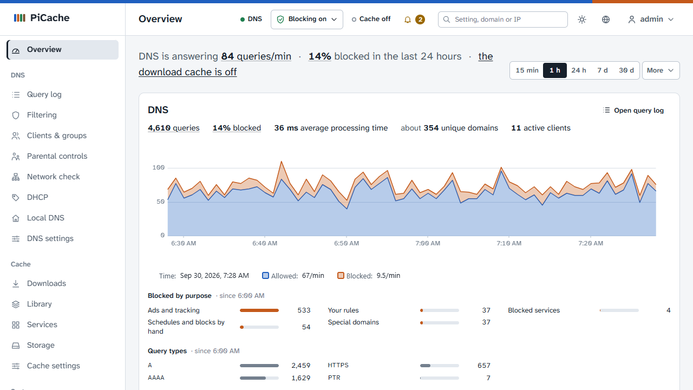
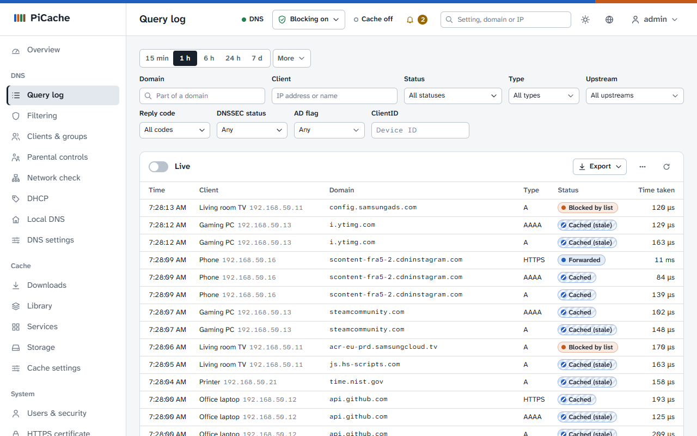
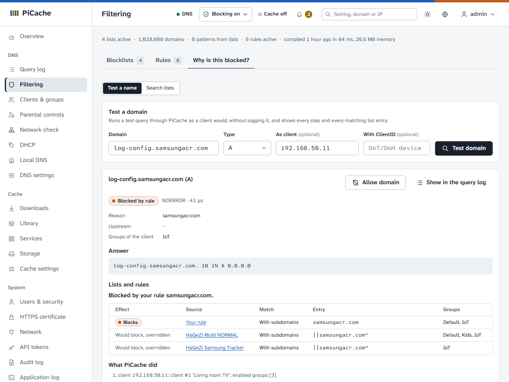
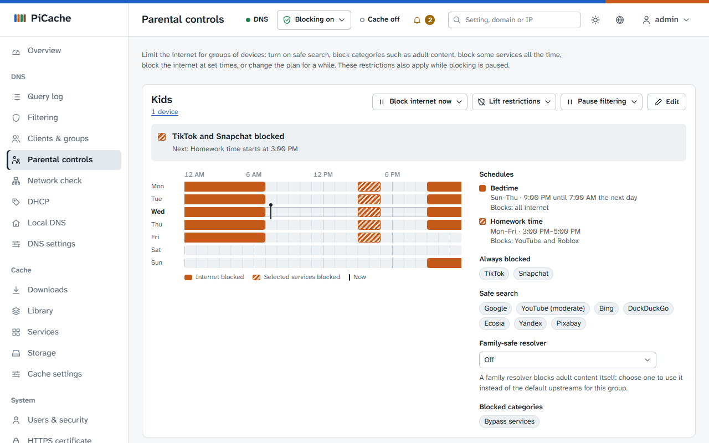
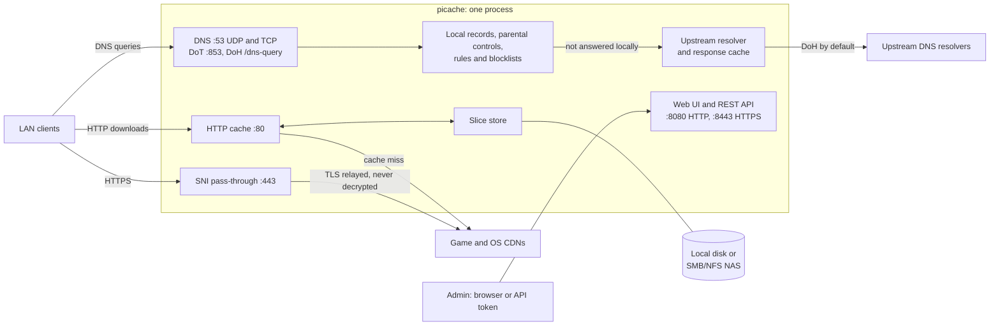

# PiCache

[](https://github.com/Hustenreizjuengling/PiCache/actions/workflows/ci.yml)
[](LICENSE)
[](go.mod)

**PiCache is the DNS server for your home network: it filters ads,
trackers and malware for every device, keeps an eye on the network, and
can also cache game and OS downloads.** It is one static Go binary with a
web UI built in, for a Raspberry Pi 4 or 5, a small VM, an unprivileged
Proxmox container or Docker. There is no nginx, BIND, dnsmasq or cron
underneath: one process, one configuration database.



**Contents:** [Goals](#goals) · [Features](#features) ·
[Screenshots](#screenshots) · [Requirements](#system-requirements) ·
[Installation](#installation) · [Quick start](#quick-start) ·
[Docker](#docker) · [Configuration](#configuration) ·
[Network and DNS](#network-and-dns) · [Data](#data-and-persistence) ·
[Backup](#backup-and-restore) · [Updates](#updates-and-going-back) ·
[Architecture](#architecture) · [API](#api) ·
[Development](#development) · [Troubleshooting](#troubleshooting) ·
[Security](#security) · [Limitations](#known-limitations) ·
[Documentation](#documentation) · [License](#license) ·
[Deutsch](#kurzüberblick-deutsch)

## Goals

- **Security and simplicity first.** An unprivileged service in a
  hardened systemd sandbox or a distroless container, secure defaults (not
  an open resolver, web UI only from your own networks), signed releases.
- **Local and private.** Everything runs and stays on your machine: no
  account, no cloud service, no telemetry. Outbound traffic is what its
  job needs: DNS to your upstream servers, list downloads and a daily
  update check that you can switch off.
- **Bounded resources.** Every cache, queue and upload has a limit; the
  blocklists follow the memory of the host; the log database has a size
  cap.
- **Understandable.** Every answer can be traced: the query log, "Why is
  this blocked?" and the health checks say what PiCache did and why.
- **Safe upgrades.** Database copies before every migration, an automatic
  rollback when an update from the web UI does not start, documented
  upgrade notes and a documented way back.

## Features

**DNS filtering**

- Blocklists in hosts, domain, adblock and regular-expression formats,
  updated automatically; a catalogue of 68 checked lists by category
  (HaGeZi Multi NORMAL on by default); allowlists; lists of malicious
  answer addresses. A list can never block a whole top-level domain or
  your private networks by mistake.
- Own allow and block rules for names, subdomains or regular expressions,
  per query type, with their own reply; import and export as text; "Why is
  this blocked?" traces every step of a lookup.
- Groups: clients by IP address, network, MAC address, ClientID, interface
  or host name get the lists and rules of their groups; "Only for this
  device" in the query log; a family-safe resolver per group.
- Blocking replies `0.0.0.0` (default), NXDOMAIN, NODATA, REFUSED or an
  address of your choice; a pause from 30 seconds up to 7 days; CNAME
  inspection.

**Parental controls** (per group, all local)

- Block 144 apps and sites in 13 categories (YouTube, TikTok, Roblox, …)
  always or on weekly schedules (bedtime, homework time), "block internet
  now" and "lift restrictions" for a while.
- Safe search for Google, YouTube, Bing, DuckDuckGo, Ecosia, Yandex and
  Pixabay; category switches for adult content, gambling, dating, piracy
  and DNS/VPN bypass. All of it stays on while blocking is paused.

**Resolution, privacy and protection**

- Encrypted upstreams: DNS-over-HTTPS (Quad9 by default), DNS-over-TLS,
  DNS-over-QUIC, DNS over HTTP/3, DNSCrypt and DNS stamps, plus plain
  DNS; a fallback resolver of another operator; response cache with
  serve-stale; conditional forwarding.
- Local DNSSEC validation from the root zone's keys (on in new
  installations), with the status of every answer in the query log.
- Encrypted DNS for your devices: DNS-over-TLS (port 853) and
  DNS-over-HTTPS (`/dns-query`), ClientIDs, discovery (DDR) and Apple
  configuration profiles; plain DNS can be switched off.
- Not an open resolver, rate limits, DNS rebinding protection, private
  reverse lookups and bare names never sent upstream, blocked clients.

**Your network**

- Local DNS records (A, AAAA, CNAME, TXT, SRV, MX, PTR, HTTPS, SVCB,
  wildcards, per group) and the router's local names.
- Network check: shows whether every device uses PiCache and how to fix
  the router (FRITZ!Box steps built in), and a getting-started checklist.
- Optional DHCP server with reservations and IPv6 DNS announcements, for
  routers that cannot hand out another DNS server; off by default.
- Full IPv6 support: devices recognised across their IPv4 and IPv6
  addresses, DNS64, "no AAAA answers" for broken IPv6.

**Download cache** (off until you enable it)

- Caches game and OS downloads that CDNs deliver over plain HTTP (Steam,
  Epic, Battle.net, Riot, Xbox, Windows Update, PlayStation, Nintendo, …)
  from the [uklans/cache-domains](https://github.com/uklans/cache-domains)
  lists, on a local disk or an SMB/NFS NAS; HTTPS is passed through by
  SNI, never decrypted. Steam finds the cache by itself; prefill tools
  work. The UI shows what was downloaded and how much bandwidth was saved.

**Operation**

- Web UI in English and German, light and dark, search over all
  settings; query log with filters and NDJSON/CSV export; statistics up
  to a year; privacy levels; application log, host resources and a
  redacted support bundle.
- Accounts with the roles admin and viewer, TOTP two-factor sign-in, API
  tokens (`read`, `admin`, `sync`), audit log.
- Backups (download, scheduled to disk or NAS, restore of selected
  sections), signed updates from the web UI with automatic rollback,
  notifications (ntfy, Gotify, webhook), Prometheus metrics, a follower
  that syncs from a primary, and a command line for scripts.

The complete behaviour is specified in
[docs/ARCHITECTURE.md](docs/ARCHITECTURE.md).

## Screenshots

A demo network with made-up devices, built from the current source.

<table>
  <tr>
    <td width="33%" valign="top">
      <a href="docs/images/query-log.png"></a><br>
      <b>Query log:</b> every query with the device, its type, what PiCache did (cached, forwarded, blocked by a list or rule, …) and the time it took.
    </td>
    <td width="33%" valign="top">
      <a href="docs/images/why-blocked.png"></a><br>
      <b>Why is this blocked?</b> a test lookup for one device shows which rule or list decides, the answer and every step.
    </td>
    <td width="33%" valign="top">
      <a href="docs/images/parental-controls.png"></a><br>
      <b>Parental controls:</b> a bedtime and a homework schedule, always-blocked services and safe search for the group "Kids".
    </td>
  </tr>
</table>

Pictures of the download cache pages (Downloads, Library) from an earlier
version are in [docs/screenshots](docs/screenshots/).

## System requirements

- **Linux.** With systemd 247 or later for a native installation: Debian
  12/13 (Raspberry Pi OS included), Ubuntu 22.04 or later, Fedora,
  RHEL/Alma/Rocky 9 or later, Arch, openSUSE Tumbleweed and Leap 16
  (others with a warning). Anywhere else: Docker with host networking.
- **CPU:** amd64, arm64 and armv7 are supported; armv6 (Pi Zero W, Pi 1),
  386 (SSE2) and riscv64 are best effort (built and started under
  emulation in CI, not tested on hardware). Container images exist for
  amd64, arm64, arm/v7 and riscv64.
- **Memory:** at least 512 MB (256 MB is not supported). The blocklists'
  entry budget follows it: 4 000 000 entries from 1 GB, 2 000 000 at
  512 MB.
- **Disk:** the databases on a local disk (never NFS or SMB). For the
  download cache an SSD or a NAS share, not an SD card.
- **Network:** a static address (or a DHCP reservation) and these ports
  on the machine: 53 udp+tcp (DNS), 8080 and 8443 tcp (web UI), 80 and
  443 tcp (download cache), 853 tcp (DNS-over-TLS); 67 and 547 udp only
  with the DHCP server, 123 udp only with the NTP server.

A Raspberry Pi 4 or 5 with a 64-bit OS and a USB SSD is a good home for
it.

## Installation

Every release on
[GitHub](https://github.com/Hustenreizjuengling/PiCache/releases) has
static binaries, Debian packages, the deploy files and `SHA256SUMS` with an
Ed25519 signature; images are at `ghcr.io/hustenreizjuengling/picache`.
All the details are in [docs/DEPLOYMENT.md](docs/DEPLOYMENT.md).

**One line** (Linux with systemd; bare metal, VM, Raspberry Pi, LXC):

```sh
curl -fsSL https://github.com/Hustenreizjuengling/PiCache/releases/latest/download/get-picache.sh | sudo sh
```

The script verifies the release signature before it installs anything and
shows the setup token at the end. To read it first, download it and run
`sudo sh get-picache.sh`. Options (a version, NAS mounts from the web UI,
no update helper) are in [One-line install](docs/DEPLOYMENT.md#one-line-install).

**By hand:** download the binary for your machine
(`picache-linux-amd64`, `-arm64`, `-armv7`, `-armv6`, `-386` or
`-riscv64`), `picache-deploy.tar.gz`, `SHA256SUMS` and `SHA256SUMS.sig`,
[check them](docs/DEPLOYMENT.md#download), then:

```sh
tar -xzf picache-deploy.tar.gz          # deploy/, LICENSE, THIRD_PARTY_NOTICES.md
sudo sh deploy/install.sh --binary ./picache-linux-amd64
sudo picache setup-token
```

The installer creates the system user `picache`, installs the hardened
unit and starts PiCache; it never changes your firewall or
systemd-resolved, it prints what to do instead.

**Debian package** (Debian, Ubuntu, Raspberry Pi OS; updated with apt):
download `picache_<version>_<arch>.deb` with `SHA256SUMS` and
`SHA256SUMS.sig`, [verify them](docs/DEPLOYMENT.md#debian-package)
(`apt install ./file` checks no signature), then:

```sh
sudo apt install ./picache_<version>_<arch>.deb
sudo picache setup-token
```

**Docker:** see [Docker](#docker) below.

**Proxmox VE:** an unprivileged Debian 12/13 container with `nesting=1`
and the same installer; NAS shares are mounted on the host
([deploy/lxc/README.md](deploy/lxc/README.md)).

**NAS** (Unraid, TrueNAS SCALE, Synology): templates that give PiCache its
own LAN address ([NAS](docs/DEPLOYMENT.md#nas)).

**From source:** Go 1.27, Node.js 22 and GNU make:

```sh
git clone https://github.com/hustenreizjuengling/picache.git
cd picache
make                  # web UI + bin/picache for this machine
make build-all        # static bin/picache-linux-{386,amd64,arm64,armv6,armv7,riscv64}
sudo sh deploy/install.sh --binary bin/picache-linux-amd64
```

## Quick start

1. Open `https://<PiCache IP>:8443/` (accept the certificate warning once,
   or trust PiCache's local CA later) or `http://<PiCache IP>:8080/`.
2. Enter the one-time setup token and create the admin account. The token:
   `sudo picache setup-token`, `docker exec -u 65532:65532 picache
   /picache setup-token`, or the log (`journalctl -u picache`).
3. Set the DNS server of your router's DHCP server to PiCache's address
   ([ROUTERS.md](docs/ROUTERS.md)). **DNS → Network check** shows whether
   your devices use PiCache and what to fix.
4. Switch on scheduled backups (**System → Backup & restore**; they are
   off by default).
5. Optional: groups and parental controls, encrypted DNS for your devices
   ([DEVICES.md](docs/DEVICES.md)), the download cache (**Cache**).

Coming from another DNS filter? [Moving from another DNS
filter](docs/GUIDES.md#moving-from-another-dns-filter) brings its lists,
rules, local records, forwarders and clients over and switches without an
outage.

## Docker

```sh
git clone https://github.com/hustenreizjuengling/picache.git   # or unpack picache-deploy.tar.gz
cd picache/deploy/docker
docker compose up -d                                           # ghcr.io/hustenreizjuengling/picache:latest
docker exec -u 65532:65532 picache /picache setup-token
```

`deploy/docker/docker-compose.yml` uses **host networking**, so PiCache
sees the real client addresses and MAC addresses. The container starts as
root only to bind its ports, then runs as `65532:65532` with all other
capabilities dropped, a read-only root filesystem and
`no-new-privileges`; its health check is `picache healthcheck`. Data lives
in the volumes `picache-data` (`/data`) and `picache-cache` (`/cache`).
Keep `restart: unless-stopped` and `stop_grace_period: 30s`: PiCache exits
to restart itself.

- **Commands:** `docker exec -u 65532:65532 picache /picache <command>`,
  logs with `docker compose logs -f picache`.
- **Update:** `docker compose pull && docker compose up -d` (tags `X.Y.Z`,
  `X.Y` and `latest`).
- **Build from source:** `docker compose up -d --build` in a clone.
- **Own LAN address** (a NAS or a host whose ports 53, 80 or 443 are
  taken): `docker-compose.macvlan.yml`. **Bridge networking**
  (`docker-compose.bridge.yml`) works with limits: no MAC addresses, no
  DHCP server, and you must set the cache address yourself.
- Docker Desktop on macOS and Windows is not a deployment target.

Details: [Docker](docs/DEPLOYMENT.md#docker).

## Configuration

Almost everything is configured in the web UI and stored in the database:
upstreams, lists, rules, clients, groups, local DNS, parental controls,
privacy, backups. The same settings are JSON through the API and the
command line (`picache config get`, `picache config apply file.json
--dry-run`); `PICACHE_INITIAL_CONFIG` applies such a document at the first
start ([Command line and automation](docs/DEPLOYMENT.md#command-line-and-automation)).

A few bootstrap settings are needed before the database opens. They come
from environment variables: in `/etc/picache/picache.env` on a native
installation (read by systemd and every `picache` command; restart after a
change), in `environment:` of the compose file with Docker. The listeners
can also be saved under **System → Network**; a variable wins.

| Variable | Default (Linux · Docker) | Purpose |
|---|---|---|
| `PICACHE_DATA_DIR` | `/var/lib/picache` · `/data` | databases, keys, certificates (local disk only) |
| `PICACHE_CACHE_DIR` | `/var/cache/picache` · `/cache` | the built-in download cache store |
| `PICACHE_DNS_LISTEN` | `:53` | DNS over UDP and TCP (required) |
| `PICACHE_WEB_LISTEN` / `PICACHE_WEB_TLS_LISTEN` | `:8080` / `:8443` | web UI and API over HTTP / HTTPS |
| `PICACHE_CACHE_LISTEN` / `PICACHE_SNI_LISTEN` | `:80` / `:443` | download cache and HTTPS pass-through |
| `PICACHE_DOT_LISTEN` / `PICACHE_DOH_LISTEN` | `:853` / `off` | DNS-over-TLS, a DoH-only listener |
| `PICACHE_NTP_LISTEN` | `off` | the optional NTP server, e.g. `:123` |
| `PICACHE_WEB_HOSTS` | – | extra host names for the web UI |
| `PICACHE_WEB_TLS_CERT` / `PICACHE_WEB_TLS_KEY` | – | your own certificate files (reloaded when renewed) |
| `PICACHE_DHCP` | – | `off` prevents the DHCP server |
| `PICACHE_CONFIG_LOCKED` | `off` | `on`: only admin API tokens change the configuration |
| `PICACHE_DESTRUCTIVE_API` | `on` | `off` refuses restores, purges and other bulk deletions |
| `PICACHE_LOG_LEVEL` | `info` | `debug`, `info`, `warn`, `error` |
| `PICACHE_ADMIN_PASSWORD_FILE` | – | create the first admin from a file instead of the setup token |
| `PICACHE_RUN_AS` | – · `65532:65532` | the user a container switches to after binding its ports |

Listener values are comma-separated `host:port` lists; `off` disables one.
Every variable and every `picache serve` flag is in
[Environment variables](docs/DEPLOYMENT.md#environment-variables).

## Network and DNS

- **Port 53.** DNS is mandatory: PiCache does not start while another
  program holds port 53 (often systemd-resolved's stub listener, dnsmasq
  or another DNS filter). The installer detects it, does not start
  PiCache and prints the fix ([Troubleshooting](#troubleshooting)).
- **Router.** Set the DNS server option of the router's **DHCP server** to
  PiCache's address. Do not make PiCache the router's own upstream: then
  every query comes from the router and per-device groups cannot work.
  Steps for common routers: [ROUTERS.md](docs/ROUTERS.md); the FRITZ!Box
  steps are also in the network check.
- **IPv6.** Give PiCache a unique local address (`fd…`) and let the router
  announce it as IPv6 DNS server, or turn the router's own IPv6 DNS
  announcement off, or devices bypass PiCache over IPv6. Never announce a
  global address: it changes with the provider's prefix
  ([IPv6](docs/DEPLOYMENT.md#ipv6-and-dual-stack-networks)).
- **Who may ask.** Loopback, private networks (RFC 1918, ULA, CGNAT,
  link-local) and the private networks the machine is connected to. A
  public IPv6 prefix of your LAN needs **DNS settings → Access** (allow the
  connected networks, or add the prefix).
- **Never forward** PiCache's ports on the router. Away from home, use a
  VPN ([GUIDES.md](docs/GUIDES.md#filtering-away-from-home)); host firewall
  rules are in [GUIDES.md](docs/GUIDES.md#firewall-rules).

## Data and persistence

| Data | Native installation | Docker | Back up? |
|---|---|---|---|
| Configuration, accounts, audit log (`picache.db`) | `/var/lib/picache` | volume `picache-data` at `/data` | **yes** |
| Master key (`keys/master.key`) and local CA (`tls/`) | `/var/lib/picache` | `/data` | **yes**, separately and privately |
| Query log and statistics (`logs.db`) | `/var/lib/picache` | `/data` | optional |
| Pre-upgrade copies and scheduled backups (`backups/`) | `/var/lib/picache` | `/data` | send scheduled backups to a NAS target |
| Lists, cache-domains, cache indexes | `/var/lib/picache` | `/data` | no, rebuilt |
| Download cache (slice files) | `/var/cache/picache`, NAS shares below `/srv/picache` | volume `picache-cache` at `/cache` | no, it fills again |
| Bootstrap settings | `/etc/picache/picache.env` | the compose file | yes |

The master key opens the stored secrets (NAS passwords, notification
tokens, TOTP secrets in file copies); `tls/` holds the CA your devices
trust. Neither is part of a backup of `picache.db`. Details:
[Persistent data](docs/DEPLOYMENT.md#persistent-data).

## Backup and restore

- **Download a backup:** **System → Backup & restore → Download**
  (`picache-backup-<date>.db`): the configuration and the audit log,
  never accounts, sessions or API tokens.
- **Scheduled backups** daily or weekly to the data directory or a NAS
  target, keeping the newest 1–90. **Off by default**: switch on **Back
  up automatically**.
- **Restore** everything or selected sections (for example only lists and
  rules) in the web UI with your password, or from the host:

  ```sh
  sudo picache restore /path/to/picache-backup-2026-09-01.db --sections lists-and-rules,local-dns
  sudo systemctl restart picache
  ```

  A restore keeps the running instance's accounts; the previous database
  stays as `picache.db.before-restore`.
- **Moving to another machine:** copy `picache.db`, `keys/master.key` and
  `tls/` with PiCache stopped, or restore a backup there and copy the key
  and `tls/`.

Automated backups with an API token, file copies and the recovery of a
damaged database: [Backup and restore](docs/DEPLOYMENT.md#backup-and-restore).

## Updates and going back

PiCache checks GitHub for new releases once a day (switch it off under
**System → Updates**) and installs one only when an admin asks. Every file
is checked against `SHA256SUMS` and its Ed25519 signature by the release
key built into the running binary ([docs/release-key.pem](docs/release-key.pem)).

| Installation | Update |
|---|---|
| Native (bare metal, VM, LXC) | **System → Updates → Install update**, or `sudo picache update` |
| Without Internet access | `sudo picache update --from <directory with the release files>` |
| Debian package | verify and `sudo apt install ./picache_<version>_<arch>.deb` |
| Docker | `docker compose pull && docker compose up -d` |

- **Migrations are automatic.** Before a new version migrates anything,
  it copies `picache.db` to `<data>/backups/picache-<previous
  version>-<timestamp>.db` (the newest three are kept); without the copy
  it does not start.
- **Automatic rollback** for updates from the web UI and `sudo picache
  update`: if the new version does not become healthy within 90 seconds,
  the previous program, its unit files and the database copy are put back.
  Debian packages and Docker have no automatic rollback.
- **Channels:** Stable, Beta (release candidates) and Nightly (untested
  builds of `main`; the web UI installs them only on hosts set up with
  `install.sh --nightly`).
- **Upgrade notes** are in [CHANGELOG.md](CHANGELOG.md) and in
  [Updates](docs/DEPLOYMENT.md#updates) for each release that needs them.
- **Going back** to an older release means the older program **and** the
  database copy named after it, because an older version refuses a
  database a newer one migrated. The installer refuses an older release
  unless `PICACHE_ALLOW_DOWNGRADE=1` is set; `sudo picache update --version
  vX.Y.Z --allow-downgrade` installs one. Step by step: [Going back to an
  earlier version](docs/DEPLOYMENT.md#going-back-to-an-earlier-version).

Releases follow Semantic Versioning (`vX.Y.Z`, release candidates
`vX.Y.Z-rc.N`). Only the newest release gets fixes.

## Architecture


```mermaid
flowchart LR
    clients["LAN clients"]
    admin["Admin: browser or API token"]

    subgraph picache["picache: one process"]
        dns["DNS :53 UDP and TCP<br/>DoT :853, DoH /dns-query"]
        pipeline["Local records, parental controls,<br/>rules and blocklists"]
        resolver["Upstream resolver<br/>and response cache"]
        proxy["HTTP cache :80"]
        sni["SNI pass-through :443"]
        web["Web UI and REST API<br/>:8080 HTTP, :8443 HTTPS"]
        store["Slice store"]
    end

    upstreams["Upstream DNS resolvers"]
    cdns["Game and OS CDNs"]
    disk[("Local disk or<br/>SMB/NFS NAS")]

    clients -->|DNS queries| dns --> pipeline -->|not answered locally| resolver -->|DoH by default| upstreams
    clients -->|HTTP downloads| proxy
    clients -->|HTTPS| sni
    proxy <--> store
    store --- disk
    proxy -->|cache miss| cdns
    sni -->|TLS relayed, never decrypted| cdns
    admin --> web
```

A query passes access control and the rate limit, client identification,
PiCache's own names and local records, parental controls, the download
cache answers, the rules and lists, conditional forwarders, the response
cache and the upstreams, and then the checks of the answer (CNAME targets,
rebinding, answer addresses); "Why is this blocked?" shows every step.
For enabled download services the DNS server answers with PiCache's own
address, so the downloads reach the cache.
Three kinds of SQLite database (configuration, logs, one index per cache
store) live in the data directory; the slice files of the cache may live
on a NAS. The specification is [docs/ARCHITECTURE.md](docs/ARCHITECTURE.md).

**Stack:** Go 1.27 without cgo (static binaries), the standard library
for HTTP, TLS and logging; Svelte 5, TypeScript and Vite for the web UI,
embedded into the binary, with uPlot for charts and self-hosted fonts (no
CDN, a strict Content-Security-Policy). Third-party Go modules, deliberately
few:

| Module | Version | Used for |
|---|---|---|
| `github.com/miekg/dns` | v1.1.73 | DNS messages, the UDP and TCP listeners, upstream exchanges, the DNSSEC primitives |
| `github.com/quic-go/quic-go` (with `quic-go/qpack` v0.6.0) | v0.63.0 | DNS-over-QUIC and DNS over HTTP/3 upstreams; client only, PiCache never listens on QUIC |
| `modernc.org/sqlite` (with `modernc.org/libc` v1.75.7 pinned) | v1.59.0 | SQLite without cgo |
| `golang.org/x/crypto` | v0.57.0 | argon2id password hashes, XChaCha20-Poly1305 for stored secrets, the DNSCrypt client (curve25519, salsa20, chacha20, poly1305, secretbox) |
| `golang.org/x/net` | v0.59.0 | public suffix list, HTTP header validation, IDNA, the SOCKS5 tunnel of the outbound proxy, the DHCP sockets |
| `golang.org/x/sys` | v0.48.0 | Linux system calls (capabilities, statfs, the mount guard, neighbour table) |
| `golang.org/x/sync` | v0.23.0 | the semaphore of the fastest-address probes |
| `golang.org/x/time` | v0.16.0 | token buckets: the global sign-in limit, DNSSEC chain lookups, fastest-address probes |

## API

- REST API under `/api/v1`, JSON only; every route is in
  [docs/API.md](docs/API.md), and an OpenAPI 3.1 document is served at
  `GET /api/v1/openapi.json` (signed in) and kept in
  [internal/api/openapi.json](internal/api/openapi.json).
- Automation uses API tokens (**System → API tokens**; creating one needs
  your password): `Authorization: Bearer pc_…`. Scopes: `read` (reads what a
  viewer sees), `admin` (changes too) and `sync` (only the configuration
  export for a follower). Tokens never manage tokens, passwords, accounts or
  certificates, restore backups or install updates: those need a browser
  session.
- `GET /metrics` (Prometheus, off by default) takes a read token;
  `GET /healthz` answers `ok` without authentication.
- Browser requests are protected against cross-site requests and DNS
  rebinding; everything that changes something is written to the audit log.

```sh
curl -fsS -H "Authorization: Bearer $PICACHE_TOKEN" http://<PiCache IP>:8080/api/v1/system/overview
```

## Development

Go 1.27, Node.js 22 with npm and GNU make; Docker for the installer and
package tests.

```sh
make web       # npm ci + the web UI into internal/webui/dist
make build     # bin/picache (embeds the UI)
bin/picache serve --dev --data-dir ./data --cache-dir ./cache \
  --dns-listen 127.0.0.1:1053 --cache-listen off --sni-listen off \
  --web-listen 127.0.0.1:8080 --web-tls-listen off --dot-listen off
PICACHE_DATA_DIR=./data bin/picache setup-token
```

`npm run dev` in `web/` starts the Vite development server, which proxies
`/api` to `127.0.0.1:8080`. The code builds and its tests run on Linux,
Windows and macOS (`*_linux.go` files have `*_other.go` fallbacks); the
service itself runs on Linux.

**Running the tests:**

```sh
make test                  # go test ./... (no network access needed)
make vet lint              # go vet for several platforms, gofmt check
cd web && npm run check    # svelte-check, translations, settings search index
cd web && npm run build    # also checks the bundle sizes
CGO_ENABLED=1 go test -race ./internal/dns/... ./internal/netutil/...
sh scripts/test-install.sh bin/picache-linux-amd64 debian:13   # installer test (Docker)
```

The CI runs these on every push and pull request, plus the tests on
Windows, macOS and linux/386, `govulncheck`, ShellCheck, the Debian
package test and a multi-architecture image build. Conventions, the
release process and the full check list are in
[CONTRIBUTING.md](CONTRIBUTING.md); the project follows its
[code of conduct](CODE_OF_CONDUCT.md).

## Troubleshooting

**System → Health & about** runs the health checks and gives a hint for
each problem; **System → Application log** shows the log
(`journalctl -u picache -f`, `docker compose logs -f picache`).

- **Port 53 is in use** (`bind DNS (udp) on :53: … port 53 is in use`):
  `sudo ss -lunp 'sport = :53'` names the program. Stop and disable
  another DNS server, or bind PiCache to specific addresses in
  `/etc/picache/picache.env` (`PICACHE_DNS_LISTEN=192.168.1.5:53,127.0.0.1:53`),
  then `sudo systemctl start picache`.
- **systemd-resolved** holds `127.0.0.53:53`: either bind PiCache to
  specific addresses as above, or turn off its stub listener and let the
  host resolve through PiCache:

  ```sh
  sudo mkdir -p /etc/systemd/resolved.conf.d
  printf '[Resolve]\nDNS=127.0.0.1\nDNSStubListener=no\n' | sudo tee /etc/systemd/resolved.conf.d/picache.conf
  sudo mv /etc/resolv.conf /etc/resolv.conf.backup
  sudo ln -s /run/systemd/resolve/resolv.conf /etc/resolv.conf
  sudo systemctl reload-or-restart systemd-resolved
  ```

- **Local names or download cache answers fail for devices that still ask
  the router:** the router's rebind protection drops answers with private
  addresses. Add exceptions for your local domain (and the download
  domains) on the router, never switch the protection off
  ([ROUTERS.md](docs/ROUTERS.md)). A service of yours whose public name
  points into your LAN shows **Rebinding blocked** in PiCache's query log:
  allow its domain there or under **DNS settings → Protection**.
- **Wrong clock** (a Raspberry Pi without a real-time clock): "system
  clock is not set; using unencrypted DNS to the bootstrap servers", or
  DNSSEC time checks suspended. Keep the host's time synchronised
  (`timedatectl set-ntp true`; `sudo apt install fake-hwclock` on a Pi) and
  give the host NTP servers by IP address if it resolves them through
  PiCache.
- **DNSSEC status "indeterminate"** (health check `dnssec`): the host clock
  is not synchronised (always so in Docker Desktop's VM), or an upstream
  returns no DNSSEC data (router DNS proxies, some ISP resolvers: choose
  other upstreams or the mode **Pass through**). **Bogus** answers get
  SERVFAIL: **Test DNSSEC** under **DNS settings → DNSSEC** checks the
  upstreams ([DNSSEC](docs/DEPLOYMENT.md#dnssec)).
- **Locked out of the web UI** (not allowed from your address, TLS 1.3
  required, a broken certificate): `sudo picache web-access --reset` on the
  host (Docker: `docker exec -u 65532:65532 picache /picache web-access
  --reset`) opens it again within a minute. A forgotten password: `sudo
  picache reset-password <user>`. Listeners saved in the UI that no
  longer work: `sudo picache listeners --reset` and a restart.
- **`421 Misdirected Request`:** the host name is not allowed; add it to
  `PICACHE_WEB_HOSTS` or the allowed hosts of the web settings.
- **Devices bypass PiCache:** **DNS → Network check** names the cause
  (the router forwards or announces itself as IPv6 DNS server, a device
  with its own DNS).

More (damaged database, a full data disk, NAS mounts, updates):
[Troubleshooting](docs/DEPLOYMENT.md#troubleshooting).

## Security

- The service runs as the unprivileged user `picache` with only
  `CAP_NET_BIND_SERVICE` in a strict systemd sandbox; the container
  switches to UID 65532 after binding its ports. PiCache never holds
  `CAP_SYS_ADMIN`; NAS mounts go through an optional root helper.
- Not an open resolver; per-client rate limits and connection caps on
  every listener; DNS rebinding protection for the whole network.
- The first account needs a one-time setup token. Passwords are hashed
  with argon2id, sign-ins are throttled, TOTP is optional. The web UI
  answers only this machine and your networks by default, with a strict
  Content-Security-Policy, `HttpOnly` and `SameSite=Strict` cookies and a
  host allowlist.
- Stored secrets are sealed with XChaCha20-Poly1305; backups never contain
  accounts or tokens. The HTTP cache serves only known download services
  and by default never connects to private addresses; HTTPS is never
  decrypted.
- Updates install only files signed with the release key.

Threat model, hardening checklist and how to report a vulnerability
**privately**: [docs/SECURITY.md](docs/SECURITY.md).

## Known limitations

- **Linux only** as a service (systemd 247 or later, or Docker). Docker
  Desktop on macOS and Windows is not a deployment target; bridge
  networking loses MAC addresses and the DHCP server.
- **Web UI in English and German** only.
- **Encrypted DNS for devices** is DNS-over-TLS and DNS-over-HTTPS only:
  DNS-over-QUIC, DNSCrypt and DNS over HTTP/3 are supported as upstreams,
  not served to clients. There is no access from the Internet: devices
  away from home use a VPN.
- **The download cache** caches plain HTTP only; HTTPS downloads are passed
  through, never intercepted.
- **DNS-based controls can be bypassed** by devices that use another
  resolver (encrypted DNS in a browser or app, a VPN, mobile data).
  ClientIDs identify devices, they do not authenticate them.
- **DHCP:** IPv4 addresses on one interface; for IPv6 only DNS
  announcements (router advertisements, stateless DHCPv6), no addresses;
  no relayed requests.
- **DNSSEC trust anchors** are built in: a future root key rollover needs
  a PiCache update. Validation needs a synchronised host clock.
- **Rebinding protection** does not cover the global IPv6 addresses of
  your LAN by default ([SECURITY.md](docs/SECURITY.md#dns-protection)).
- **Time zone:** schedules and scheduled backups use the host's time; a
  container uses UTC unless `TZ` is set.
- No text export of local records and forwarders (JSON through the API);
  statistics count an upstream's SERVFAIL as a forwarded answer; answers
  never come from the host's `/etc/hosts` (import it instead).
- **Updates:** Debian packages and Docker images have no automatic
  rollback, there is no apt repository, container images are not signed
  (the binaries and packages are), and nightly builds have no image.
- The databases must be on a local disk; only the cache's slice files may
  live on a NAS. armv6, 386 and riscv64 are best effort.

## Documentation

| Document | Contents |
|---|---|
| [docs/DEPLOYMENT.md](docs/DEPLOYMENT.md) | installation, first-run setup, certificates, reverse proxies, encrypted DNS, DNSSEC, DHCP, backups, updates, storage, environment variables, CLI, troubleshooting |
| [docs/GUIDES.md](docs/GUIDES.md) | moving from another DNS filter, Unbound, VPNs, Home Assistant and Prometheus, firewall rules |
| [docs/ROUTERS.md](docs/ROUTERS.md) · [docs/DEVICES.md](docs/DEVICES.md) | router set-up · single devices and encrypted DNS |
| [deploy/lxc/README.md](deploy/lxc/README.md) | Proxmox LXC and NAS storage |
| [docs/SECURITY.md](docs/SECURITY.md) | threat model, updates and the release key, hardening checklist, reporting vulnerabilities |
| [docs/ARCHITECTURE.md](docs/ARCHITECTURE.md) · [docs/API.md](docs/API.md) | specification · REST API |
| [docs/DESIGN.md](docs/DESIGN.md) · [web/README.md](web/README.md) · [docs/TRANSLATING.md](docs/TRANSLATING.md) | UI design system · frontend guide · translations |
| [CONTRIBUTING.md](CONTRIBUTING.md) · [CHANGELOG.md](CHANGELOG.md) | development and releases · changes and upgrade notes |

## License

PiCache is released under the [MIT license](LICENSE). The binary and the
container image also contain third-party components under their own
licenses (BSD-3-Clause, MIT, SIL Open Font License 1.1 for the fonts, and
public domain for SQLite); see
[THIRD_PARTY_NOTICES.md](THIRD_PARTY_NOTICES.md). Keep both files with every
copy you pass on. `deploy/install.sh` and the Debian package install them
to `/usr/share/doc/picache/`, and the container image contains them in the
same directory.

## Kurzüberblick (Deutsch)

PiCache ist der DNS-Server für das Heimnetz: Er filtert Werbung, Tracker
und Schadsoftware für alle Geräte, zeigt, welches Gerät was abfragt, und
kann zusätzlich Spiele- und System-Downloads zwischenspeichern. Ein
einzelnes Programm mit Weboberfläche (Deutsch und Englisch), ohne Cloud,
Konto oder Telemetrie.

- **DNS-Filter:** Blocklisten (Katalog mit 68 geprüften Listen),
  Erlaubnislisten, eigene Regeln (auch als Text importierbar), Gruppen pro
  Gerät, „Nur für dieses Gerät“, „Warum ist das gesperrt?“,
  Sperren nach Antwortadresse.
- **Jugendschutz** pro Gruppe: 144 Dienste sperren, Zeitpläne
  (Schlafenszeit, Hausaufgabenzeit), „Internet jetzt sperren“,
  SafeSearch, Kategorien (Erwachseneninhalte, Glücksspiel, Dating,
  Raubkopien, Umgehung per VPN oder verschlüsseltem DNS) – alles lokal.
- **Auflösung:** verschlüsselte Upstreams (DoH, DoT, DoQ, HTTP/3,
  DNSCrypt) mit Ausweich-DNS, eigene DNSSEC-Prüfung, verschlüsseltes DNS
  für die eigenen Geräte (DoT, DoH), lokale DNS-Einträge, bedingte
  Weiterleitungen, Schutz vor DNS-Rebinding, volle IPv6-Unterstützung.
- **Netzwerk:** Netzwerkprüfung mit Anleitung für den Router (auch
  FRITZ!Box), optionaler DHCP-Server, Checkliste für den Einstieg.
- **Download-Cache** (optional) für Steam, Epic, Battle.net, Xbox,
  Windows Update und mehr, auf SSD oder NAS; HTTPS wird nie entschlüsselt.
- **Betrieb:** Admins und Betrachter, Zwei-Faktor-Anmeldung, API-Tokens,
  Sicherungen (automatische Sicherungen sind anfangs **aus**: unter
  **System → Sicherung & Wiederherstellung → Automatisch sichern**
  einschalten), signierte Updates aus der
  Oberfläche mit automatischer Rückkehr zur alten Version,
  Benachrichtigungen, Prometheus-Metriken.

**Installation** auf Linux mit systemd (Debian, Ubuntu, Raspberry Pi OS,
Fedora, RHEL, Arch, openSUSE; auch im Proxmox-LXC):
`curl -fsSL https://github.com/Hustenreizjuengling/PiCache/releases/latest/download/get-picache.sh | sudo sh`
(prüft die Signatur). Alternativ als Debian-Paket oder mit Docker
(`deploy/docker`). Danach `http://<IP>:8080/` öffnen, das Einmal-Token von
`sudo picache setup-token` eingeben und im Router (DHCP) die IP von
PiCache als DNS-Server eintragen. Wer von einem anderen DNS-Filter kommt,
übernimmt Listen, Regeln, lokale Einträge und Weiterleitungen mit der
Anleitung in [docs/GUIDES.md](docs/GUIDES.md#moving-from-another-dns-filter).
Mindestens 512 MB Arbeitsspeicher; auf einem Raspberry Pi gehört der Cache
auf eine USB-SSD, nicht auf die SD-Karte. Die ausführliche Dokumentation
ist englisch ([docs/DEPLOYMENT.md](docs/DEPLOYMENT.md)). Sicherheitslücken
bitte vertraulich melden, siehe [docs/SECURITY.md](docs/SECURITY.md).

PiCache steht unter der MIT-Lizenz ([LICENSE](LICENSE)).
